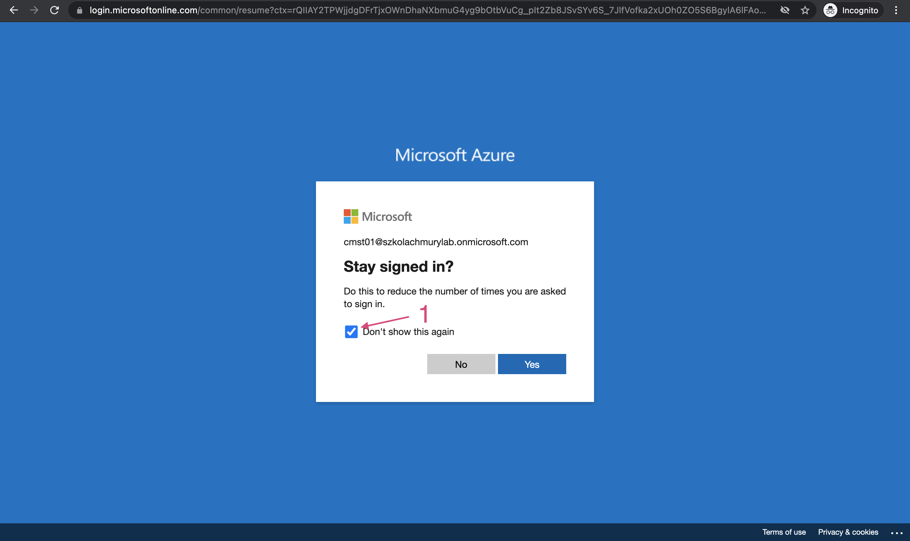

  
  
  

# Logowanie do portalu Azure

W tym laboratorium zalogujesz się do Azure Portal i wyświetlisz swoją studencką Resource Group.

---

## Krok 1: Logowanie do Azure Portal

1. Otwórz stronę [portal.azure.com](https://portal.azure.com)
1. Podaj login, który otrzymałeś od prowadzącego i kliknij _"Next"_.

    

1. Podaj hasło, które otrzymałeś od prowadzącego i kliknij _"Next"_.

    

1. Ustaw nowe, silne hasło, którego od teraz chcesz uzywać do logowania do Azure Portal. Hasło powinno składać się z przynajmniej 8 znaków, małej i wielkiej litery oraz znaku specjalnego. Przejdź dalej klikając _"Sign in"_.

    

1. Po ustawieniu hasła zostaniesz poproszony przez Azure o podanie większej liczby informacji o sobie w celu ochrony konta. Mimo to, nie jest to potrzebne na potrzeby pracy podczas szkolenia - jako Chmurowisko nie wymagamy, żebyś podawał te informacje. Na ekranie _"don't lose access to your account!"_ kliknij _"Cancel"_.

    
    

1. Na ekranie _"Stay signed in?"_ zaznacz checkbox _"Don't show this again"_ i kliknąć _"Yes"_. Po kliknięciu _"Yes"_ zostaniesz przekierowany do Portalu Azure.

    

1. Na ekranie powitalnym Portalu Azure pomiń samouczek klikając _"Maybe later"_

    

1. Jeśli zobaczysz popup/modal z informacją _"Optimize your cloud workloads with personalized recommendations"_ po prostu go zamknij. Na tę chwilę nie potrzebujesz dostosowywać Azure. 

    

## Krok 2: Zmień język wyświetlania treści w Azure Portal na angielski

Jeśli w Azure Portal treści wyświetlane są w języku polskim sugerujemy zmianę języka wyświetlania treści na angielski. Dzięki temu będzie Ci łatwiej zlokalizować opcje konfiguracji, które nalezy zmienić konfigurując usługę AKS.

1. Przejdź do [portal.azure.com](https://portal.azure.com) i uruchom kliknij w zaznaczoną ponizej ikonę:

    

1. Przejdź do sekcji _"Język i region"_, zmień ustawienia i kliknij _"Zastosuj"_. Potwierdź chęć zmiany języka.

    

## Krok 3: Wyświetl swoją Resource Group

1. Rozwiń menu po lewej stronie i kliknij na pozycję _"Resource groups"_. Zostanie wyświetlona Resource Group do której masz dostęp. W tym momencie Resource Group jest pusta, ale juz wkrótce stworzysz w niej usługę AKS.

    
    
    

1. W tym momencie zostałeś poprawnie zalogowany do Portalu Azure i zweryfikowałeś, ze Twoje konto studenckie działa poprawnie.

---

## Koniec laboratorium

  

&copy; 2021 Chmurowisko Sp. z o.o.

