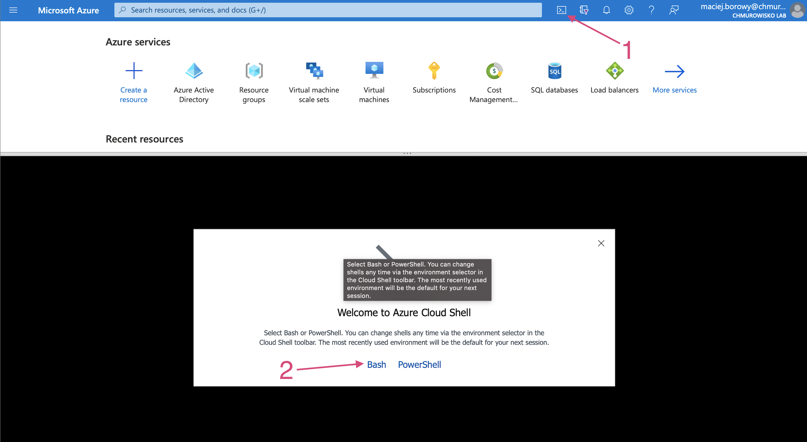
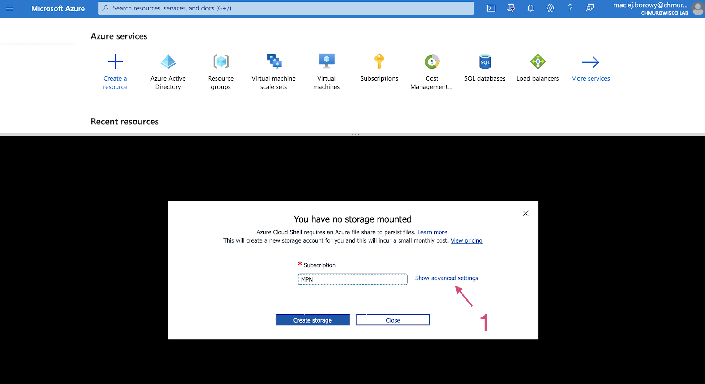
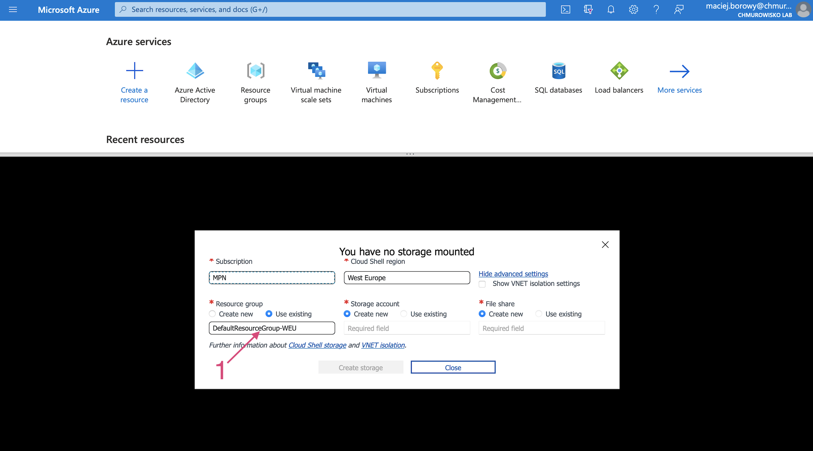
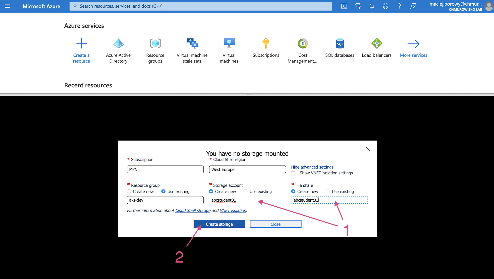
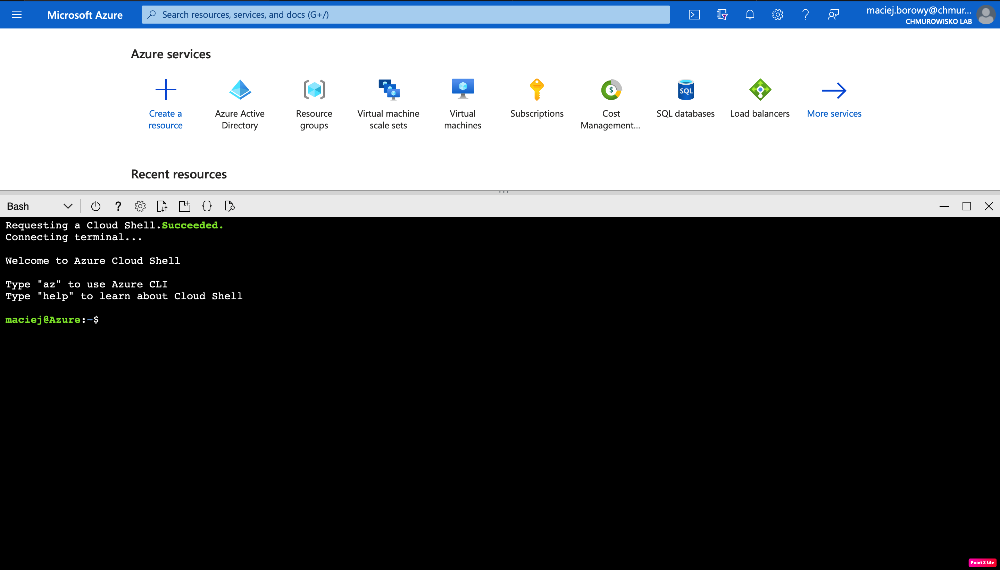

  
  
  

# Initializing Azure Cloud Shell

In this lab you'll initialize Azure Cloud Shell and connect to it.

---

1. Go to [portal.azure.com](https://portal.azure.com)
1. Open Cloud Shell and select _"Bash"_

    

1. Click on _"Show advanced settings"_

    

1. Select your student _Resource group_, provide globally unique name for _Storage account_ and _File share_ and create storage.

    
    

1. After Storage account is created you should see Cloud Shell

    

---

## END LAB

  

&copy; 2021 Chmurowisko Sp. z o.o.

