  
  
  

# Utworzenie usługi AKS

W tym laboratorium dowiesz się jak utworzyć usługę AKS oraz zalogować się do klastra Kubernetes.

---

## Krok 1: Stwórz usługę AKS

1. Przejdź do swojej Resource Group (np. `rgcmst01`) i kliknij przycisk _"Create"_.

    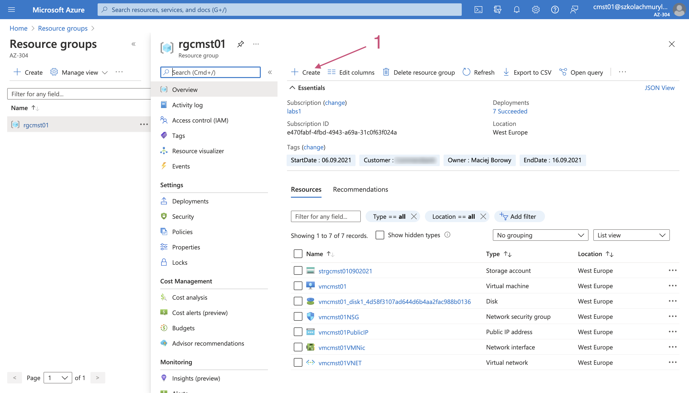

1. W wyszukiwarce wpisz `Kubernetes Service` i wyszukaj usługę klikając Enter.

    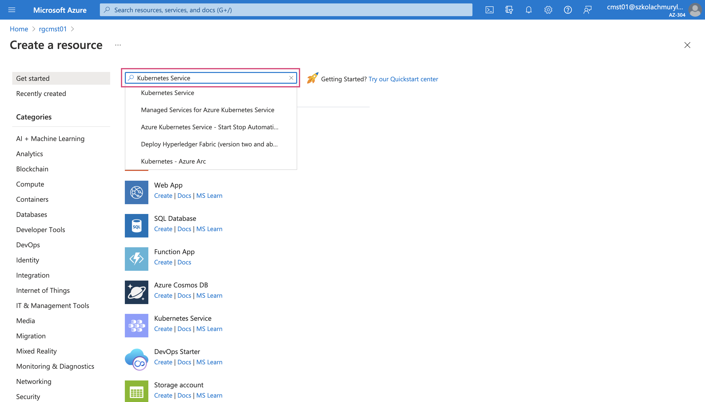

1. Na stronie szczegółów usługi "Kubernetes Service" kliknij przycisk _"Create"_ by rozpocząć proces konfiguracji nowej instancji usługi AKS.

    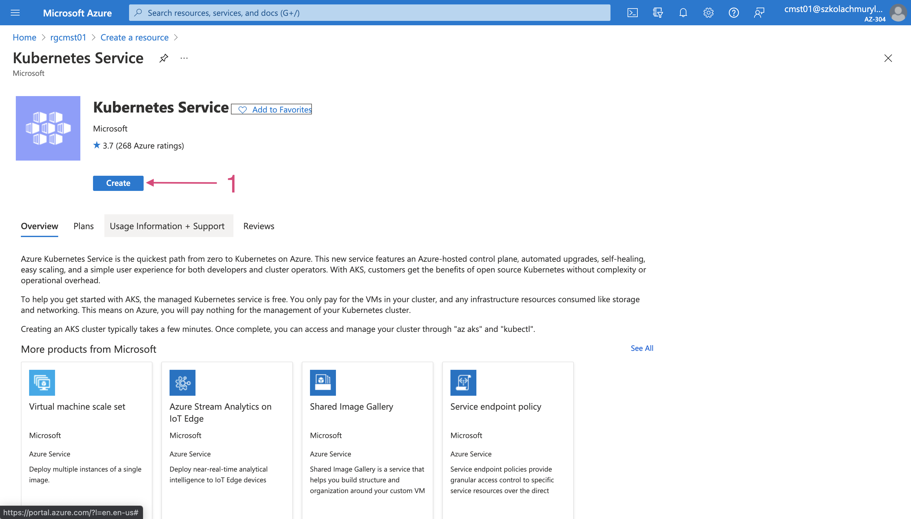

1. Skonfiguruj wartości w zakładce _"Basics"_ jak ponizej (mozesz wybrać inną nazwę klastra):

    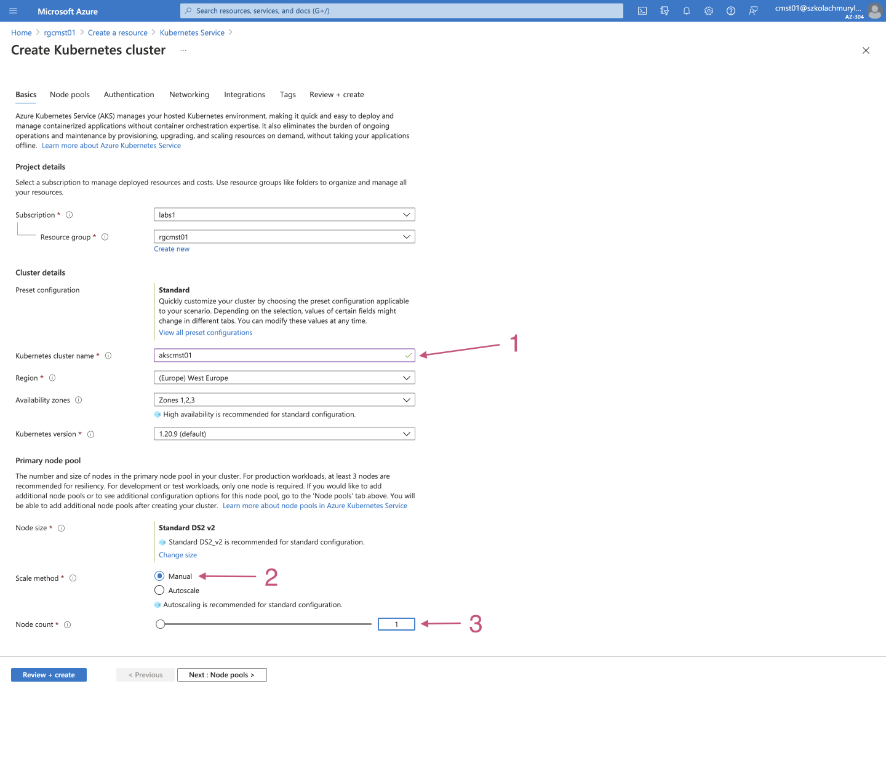

1. Przejdź do sekcji _"Node pools"_ klikając przycisk _"Next: Node pools >"_. W tej sekcji nie musisz nic zmieniać.
1. Przejdź do sekcji _"Authentication"_ klikając przycisk _"Next: Authentication >"_. W tej sekcji nie musisz nic zmieniać.
1. Przejdź do sekcji _"Networking"_ klikając przycisk _"Next: Networking >"_. W tej sekcji nie musisz nic zmieniać.
1. Przejdź do sekcji _"Integrations"_ klikając przycisk _"Next: Integrations >"_. W tej sekcji zmień ustawienia jak na poniszym rysunku:

    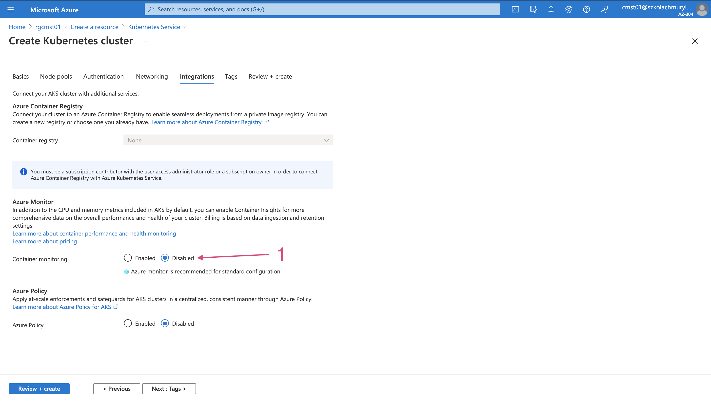

1. W tym momencie posiadasz poprawnie skonfigurowany klster. Kliknij przycisk _"Review + create"_, aby zatwierdzić konfigurację i utworzyć usługę. Jeśli otrzymałeś komunikat _"Validation passed"_ mozesz kliknąć przycisk _"Create"_.

    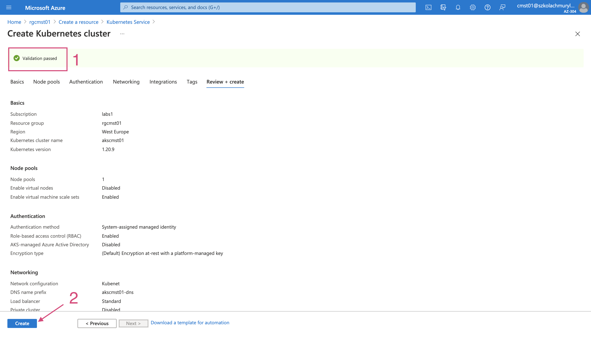

1. W trakcie wdrożenie usługi wyświetlony zostanie dla Ciebie poniższy ekran. Poczekaj aż proces wdrożenia usługi zakończy swoje działanie.

    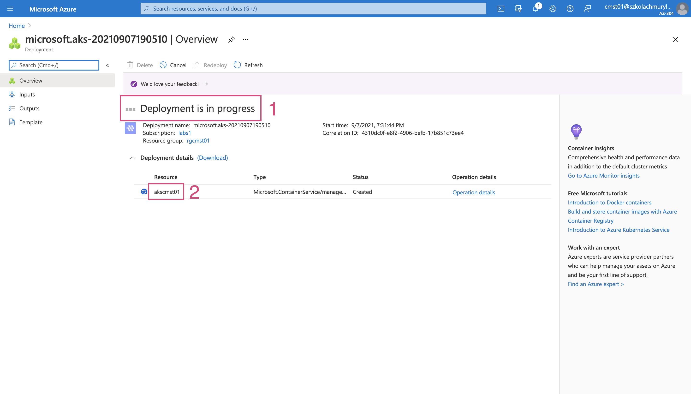
    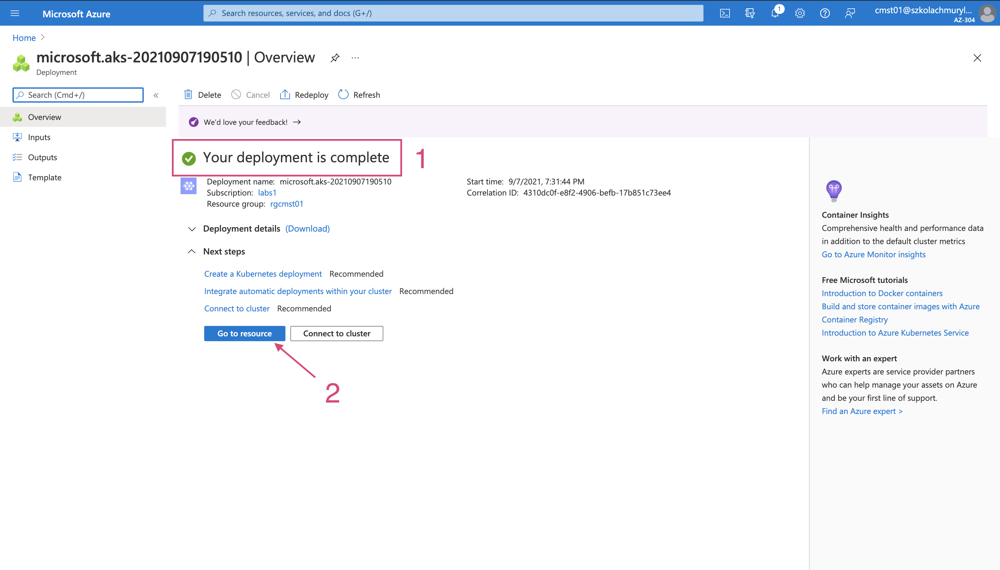

1. Ze względu na określone ustawienia subskrypcji szkoleniowej nie otrzymujesz natychmiastowego dostępu do dodatkowej Resource Group utworzonej przez Azure w celu przechowania dodatkowych usług składających się na usługę AKS. Z tego powodu możesz otrzymać komunikat jak na poniższym zdjęciu: 

    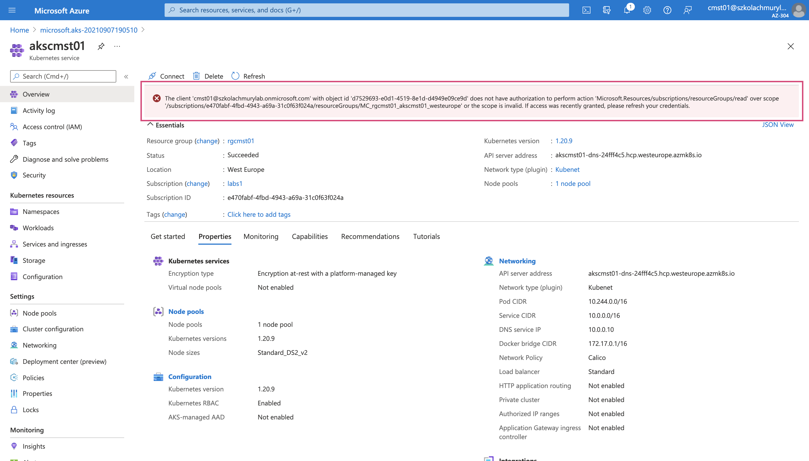

    Dostęp do dodatkowej Resource Group zostanie nadany przez prowadzących przed ćwiczeniem w którym Resource Group będzie wykorzystywana.

## Krok 2: Wywołaj komendę na klastrze Kubernetes

1. Otwórz Cloud Shell
1. Na stronie szczegółów Twojej instancji usługi AKS kliknj przycisk _"Connect"_

    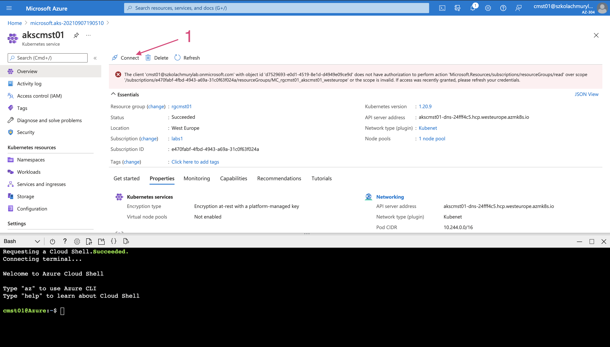

1. W Cloud Shell wywołaj obie zaznaczone komendy aby połączyć się z klastrem Kubernetes

    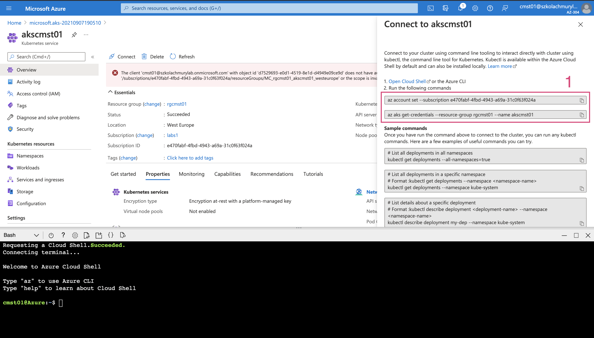

1. W Cloud Shell wywołaj komendę `kubectl get nodes` aby wylistować listę Worker Node w klastrze.

    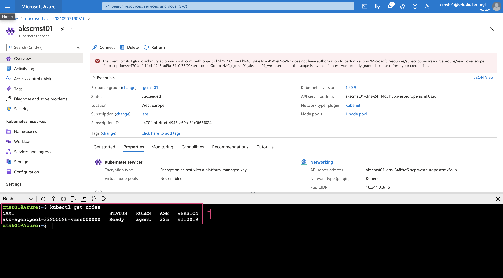

---

## Koniec laboratorium

  

&copy; 2021 Chmurowisko Sp. z o.o.

