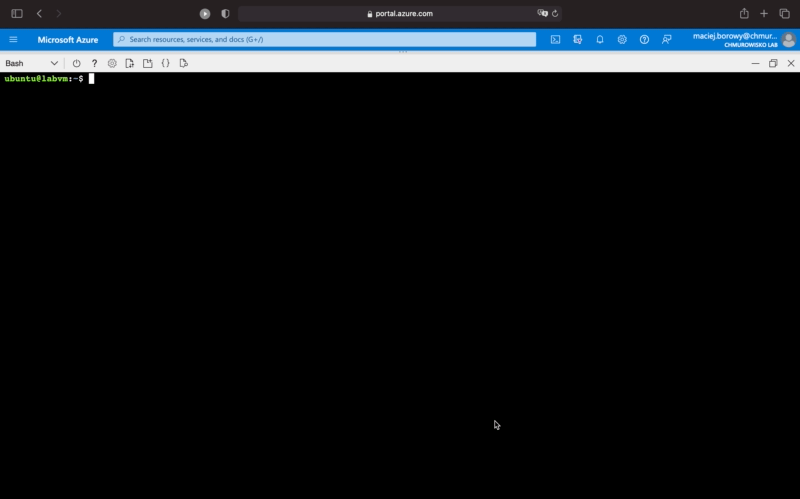

<br><br>
<br><br>
<br><br>

# Basic Docker commands

## Lab Overview

In this lab you will learn basic Docker commands and run your first container



## Task 1: Get Docker help

1. Inside your lab VM run `docker` to list all help topics:

    ```bash
    docker
    ```

1. Get help for `docker run` command:

    ```bash
    docker run --help
    ```

1. Find how to run a container using Docker

## Task 2: Run a simple nginx server in container

1. Run nginx container:

    ```bash
    docker run -p 80:80 nginx
    ```

    This command will start nginx server inside container. Nginx server will serve single, welcome HTML page.

1. Open web browser, paste virtual machine public IP address and check if nginx serve welcome page.
1. Go back to terminal

    In terminal you can see all logs produced by the nginx process. In fact you see everything that goes to a standard output of a container.

1. Stop the container using `Ctrl + C`

    Sometimes application inside container doesn't respond to `Ctrl-C` and thus doesn't exit interactive mode. If you encounter this situation you have to stop/kill container manually.

1. Check if nginx stopped responding to requests (optionally check this in incognito tab)

## Task 3: Run container in background

To run container in background (detached mode) add `-d` flag. Running container in background will free your access to the terminal.

1. Run container in detached mode: 

    ```bash
    docker run -d -p 80:80 nginx
    ```
    
    This command will output ID of a created container.

1. Go to web browser and check if nginx started to responding to requests again.

## Task 4: List running containers

1. To list all running containers execute:

    ```bash
    docker ps
    ```

1. List all containers available on host machine:

    ```bash
    docker ps -a
    ```

## Task 5: Get logs from container

1. Get logs from running container:

    ```bash
    docker logs CONTAINER_ID
    ```

    Alternatively, run `docker logs -f CONTAINER_ID` to continously stream new logs from container

1. Refresh a page and see if new logs are available.

## Task 6: Execute a command on running container

`docker exec` lets you execute command on running container. This command is useful for debugging problems with container, but you should not use it to configure running container.

1. List contents of container's current working directory: 

    ```bash
    docker exec CONTAINER_ID ls
    ```

1. Attach to container in interactive mode:

    ```bash
    docker exec -it CONTAINER_ID sh
    ```

    Now you can execute any shell command on a container (eg: `ls`, `cd`, `cat`, `curl`). Programs available to execute depends on container image.

1. Exit interactive mode by typing `exit`

    You can safely exit the interactive mode, because you won't terminate the running container.

## Task 7: Stop running container

1. Stop running container by executing:

    ```bash
    docker stop <CONTAINER_ID>
    ```

    You can find `<CONTAINER_ID>` using `docker ps`.

    `docker stop` will gracefully stop the application inside container and exit container.

1. Kill running container

    ```bash
    docker kill <CONTAINER_ID>
    ```

    `docker kill` will send forcefully terminate the application inside container and exit container.

## Task 8: Create new page to serve from nginx

1. Start new nginx container in background

    ```bash
    docker run -d -p 80:80 nginx
    ```

1. Attach to container in interactive mode:

    ```bash
    docker exec -it <CONTAINER_ID> sh
    ```

1. Go to nginx main directory that contains content to serve:

    ```bash
    cd /usr/share/nginx/html
    ```

1. Create new page `new.html`:

    ```bash
    echo "<!DOCTYPE html><head><title>Sample NGINX</title></head><body><p>This page was served from container filesystem</p></body></html>" > new.html
    ```

1. Check if nginx is running and serving new page. The page should be served at: `http://<VM_IP_ADDRESS>/new.html` (replace `<VM_IP_ADDRESS>` with your VM IP address).
1. Type `exit`. This command will exit interactive mode (the container will remain running). 
1. Stop and start container again:

    ```
    docker stop <CONTAINER_IR>
    ```

    ```bash
    docker run -d -p 80:80 nginx
    ```

1. The nginx web page will be no longer available, because every new container will have new filesystem (without `new.html`). If you want to get it back you will need to run nginx image and create page manually again. In next lab about **Dockerfiles** you will learn how to automate such tasks.

## Task 9: Clean-up resources

1. Stop all running containers.
1. You can remove stopped container by running `docker rm CONTAINER_ID`
1. Type `docker images`. It will show you all images stored on your local machine. Each image consumes some disk space (SIZE column)
1. You can remove unnecessary images by running: `docker rmi IMAGE_ID`. Note that containers that run from this images must be stopped and removed already.