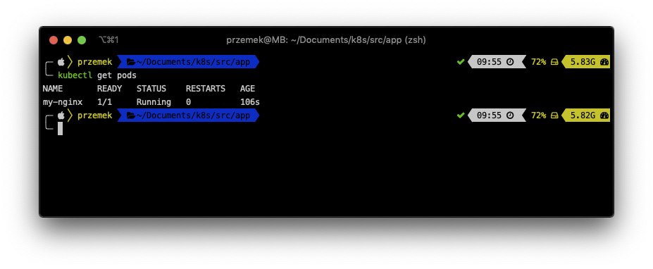
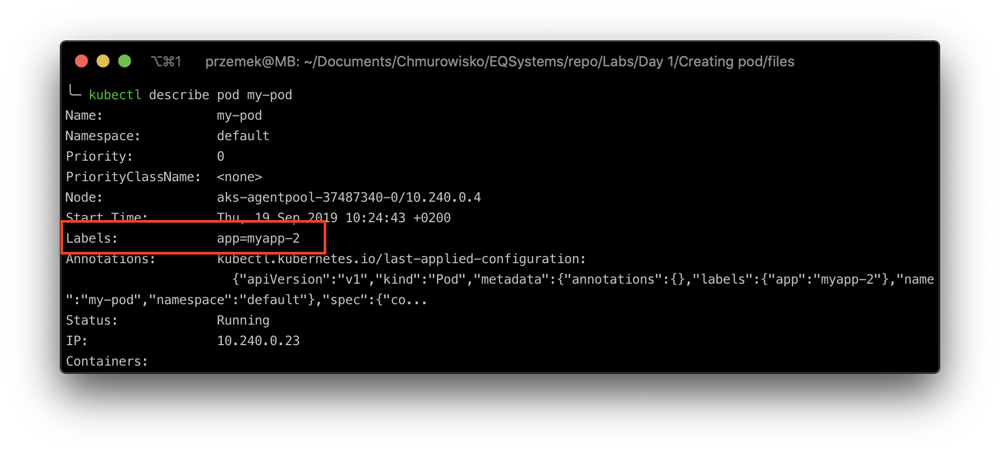
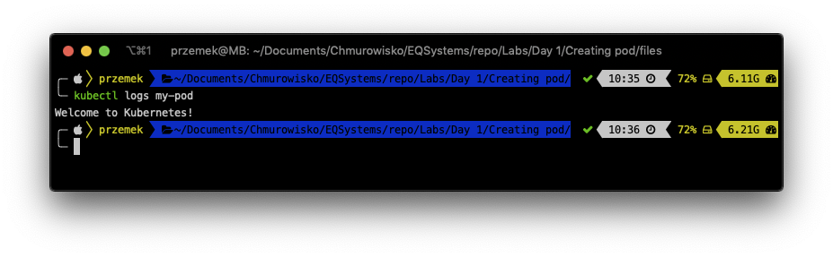
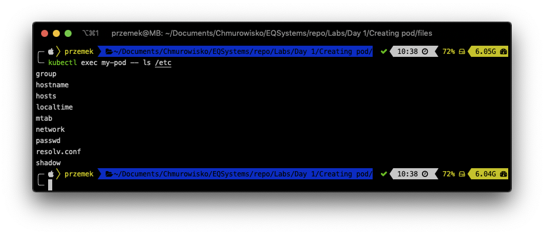
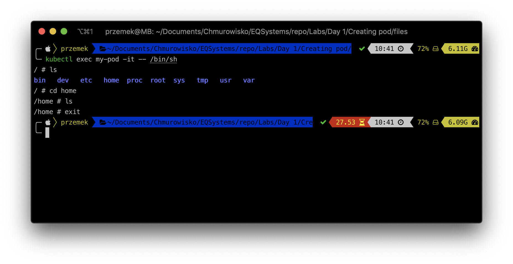

<br><br>
<br><br>
<br><br>

# Creating pod

## LAB Overview
  In this lab you will create a Kubernetes pod

## Task 1: Checking kubectl and cluster status

1. Open Cloud Shell and check `kubectl` version:

    ```bash
    kubectl version
    ```

    If `kubectl` is installed correctly you should get output similiar to:

    ```bash
    Client Version: version.Info{Major:"1", Minor:"22", GitVersion:"v1.22.2", GitCommit:"8b5a19147530eaac9476b0ab82980b4088bbc1b2", GitTreeState:"clean", BuildDate:"2021-09-15T21:38:50Z", GoVersion:"go1.16.8", Compiler:"gc", Platform:"linux/amd64"}
    Server Version: version.Info{Major:"1", Minor:"20", GitVersion:"v1.20.9", GitCommit:"8dc42052754bfacb111a0426830122dd9cc9cfa0", GitTreeState:"clean", BuildDate:"2021-08-31T00:01:04Z", GoVersion:"go1.15.14", Compiler:"gc", Platform:"linux/amd64"}
    ```

1. To check if there are any nodes available, eype ``kubectl get nodes`` and press **Enter**.
You should get at least one node.

## Task 2. Creating a pod
  In this task you will create your simple pod using CLI.

1. Still in the terminal type
   ```bash
   kubectl run my-nginx --restart=Never --image=nginx:1.7.9
   ``` 
   and press **Enter**.
1. Check if there is any pod created by typing: `kubectl get pods`.
   You should get at least one pod running.
   

## Task 3. Editing and getting pod details.

1. Type `kubectl describe pods my-nginx` and press **Enter**. Look into pod details.
1. Export pod definition by typing: `kubectl get pod my-nginx -o yaml > my_pod_definition.yaml`
1. Check if there is a definition by typing `ls` and pressing **Enter**.
1. You can examine the definition by typing `cat my_pod_definition.yaml`.
1. Edit existing pod by typing `kubectl edit pod my-nginx`.
   Pod definition should open in an editor. Edit the file by replacing line:
   `- image: nginx:1.7.9` with `- image: nginx:1.9.1` and saving the file.
1. Check if pod is updated by typing `kubectl describe pod my-nginx`. The pod should use new docker image now.
1. Make a proxy connection to your pod by typing:
   ```bash
   kubectl port-forward my-nginx 8080:80
   ```
   Now you should be able to connect to the pod using a web browser or curl. `http://localhost:8080`
1. Delete pod by typing ``kubectl delete pod my-nginx --grace-period=1``.

## Task 4. Creating and editing a pod using manifest file.

1. Create new file by typing `nano pod_definition.yaml`.
1. Download [manifest file](./files/pod_definition.yaml) and paste its content into editor.
1. Save changes by pressing *CTRL+O* and *CTRL-X*.
1. Type `kubectl create -f pod_definition.yaml` and press enter.
1. Check if there is a pod created by typing `kubectl get pods`.
1. If you have your pod created, edit the manifest file by typing `nano pod_definition.yaml`.
1. Replace lines:

   ```yaml 
   labels:
     app: myapp
   ```
   with
   ```yaml
   labels:
     app: myapp-2
   ```
   and save the file.
1. Type `kubectl apply -f pod_definition.yaml` and press **Enter**.
1. Describe the pod by typing `kubectl describe pod my-pod` and check if the definition has changed.
   

## Task 5. Examining pod logs and running a command inside the pod.
   There is a command *['sh', '-c', 'echo Welcome to Kubernetes! && sleep 3600'] * in the pod definition. The pod should write *'Welcome to Kubernetes!'* to the logs. Let's see.

1. Type `kubectl logs my-pod` and press **Enter**.
   

You can also run commands inside a pod.

1. Type `kubectl exec my-pod -- ls /etc`
   

   And you can even connect to a pod if it has any shell inside the container.

1. Type `kubectl exec my-pod -it -- /bin/sh` and press **Enter**.
   Now you can execute commands inside a container.
   

1. Delete the pod by executing following command:
   ```bash
   kubectl delete pod my-pod --grace-period=1
   ```

## END LAB

<br><br>

<center><p>&copy; 2021 Chmurowisko Sp. z o.o.<p></center>
