<br><br>
<br><br>
<br><br>

# Service

## LAB Overview
In this lab you will work with Services. An abstract way to expose an application running on a set of Pods as a network service.

## Task 1: Creating a Deployment
Create an nginx Pod, and note that it has a container port specification.
1. Open [manifest file](./files/depl.yaml) and check its contents
1. Type `kubectl apply -f depl.yaml` and press enter.
1. Get the list of running Pods with their IPs:

    ```bash
    kubectl get pods -l run=my-nginx -o wide
    ```
    
    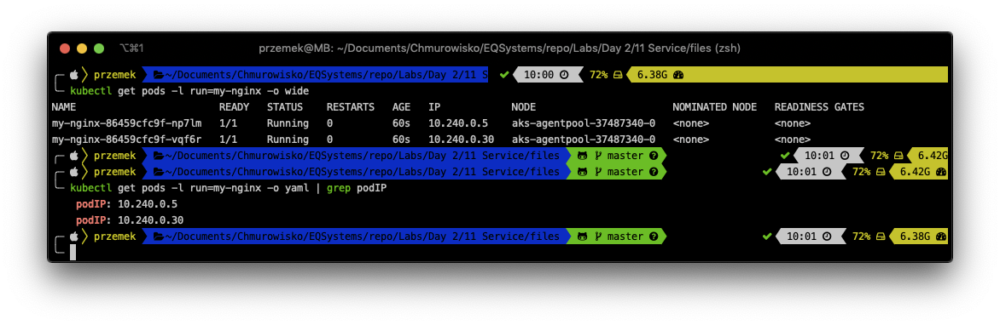

## Task 2: Creating Service

1. Create Service running following command:

    ```bash
    kubectl expose deployment my-nginx
    ```

    Instead, you can download [a manifest file](./files/service.yaml) and apply it using `kubectl apply -f service.yaml`.

    You created a Service which targets TCP port 80 on any Pod with the run: my-nginx label, and expose it on an abstracted Service port (targetPort: is the port the container accepts traffic on, port: is the abstracted Service port, which can be any port other pods use to access the Service)

1. Check the service: `kubectl get service my-nginx`

    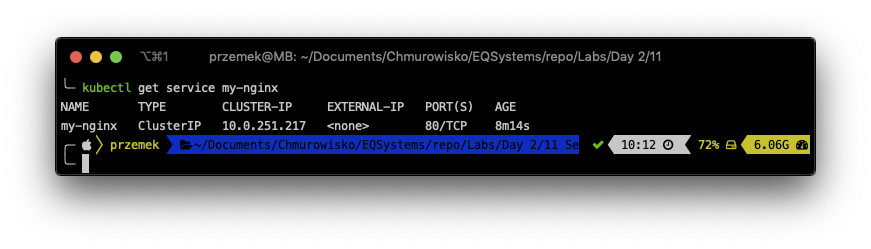

    A Service is backed by a group of Pods. These Pods are exposed through endpoints. The Service’s selector will be evaluated continuously and the results will be POSTed to an Endpoints object also named my-nginx

1. Check the endpoints, and note that the IPs are the same as the Pods created in the first step: `kubectl describe svc my-nginx `
    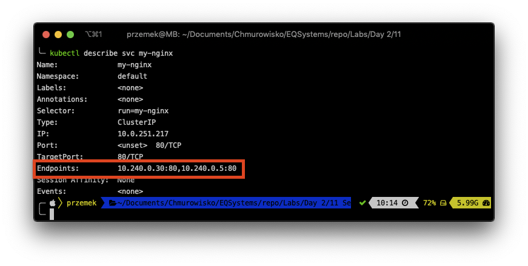

## Task 3: Accessing the Service from within the cluster using DNS

1. Check if DNS is running on the clustert: `kubectl get services kube-dns --namespace=kube-system`
    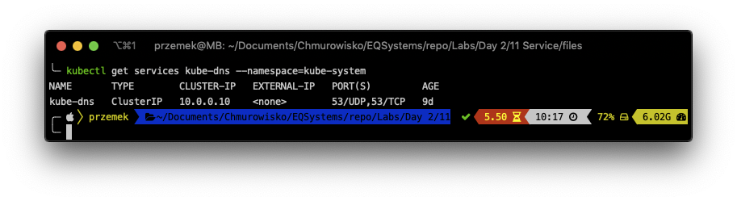
1. Use *kubectl run* to execute a container that provides the nslookup command from the dnsutils package:
    ```bash
    kubectl run curl --image=radial/busyboxplus:curl -i --tty --rm
    ```
1. Inside the container run: ``nslookup my-nginx``
    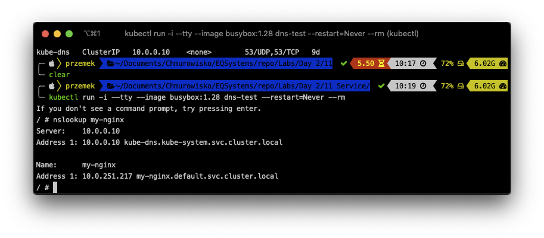

1. Still inside the container try getting data from *my-nginx* service:
    `curl my-nginx.default.svc.cluster.local`
    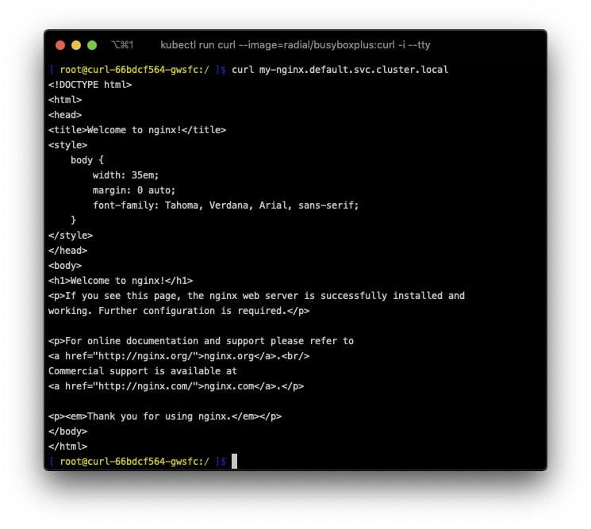

## Task 4: Exposing the Service

Kubernetes supports two ways of doing this: *NodePorts* and *LoadBalancers*. You'll create a load balancer.

1. Run `kubectl edit svc my-nginx` and set type to **LoadBalancer**. Save changes.
    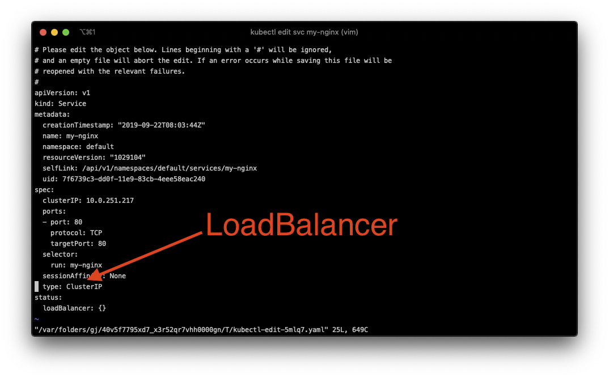
1. Run `kubectl get svc my-nginx -w` and wait for **EXTERNAL-IP
    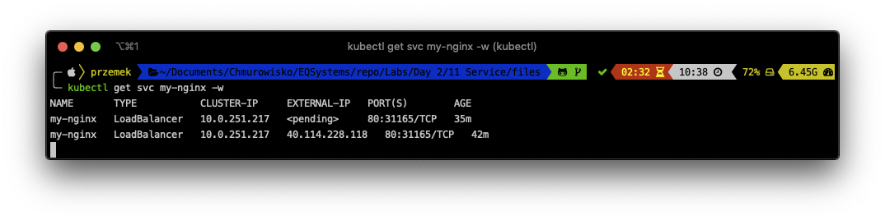
1. Using any browser of your choice, navigate to **EXTERNAL-IP** address
    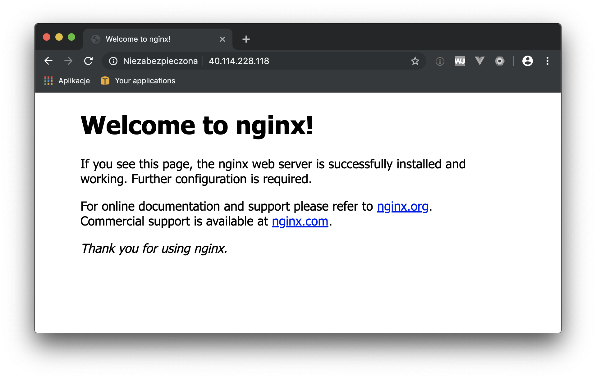
    Your service is now exposed to the Internet on unique IP address. The IP address was reserved for you by Azure.
    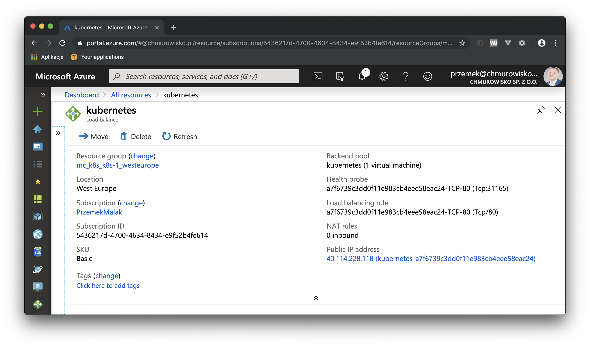

1. Describe the service: `kubectl describe service my-nginx`
    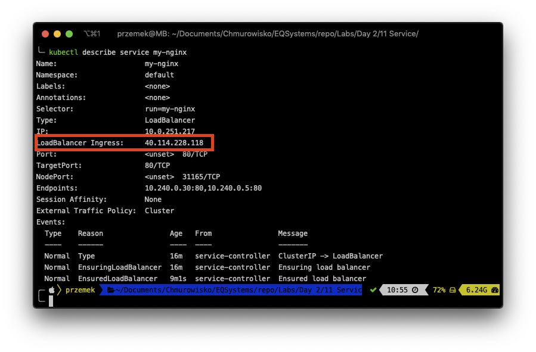

    there, you also have your Load Balances Ingress IP.

## Step 5: Exposing another Service

1. Create apache2 deployment:

    ```bash
    kubectl apply -f depl2.yaml
    ```

1. Expose apache2 server using another Service of type Load Balancer:

    ```bash
    kubectl apply -f service2.yaml
    ```

1. Check if new service has different IP address
  
    ```bash
    kubectl get svc
    ```
   
    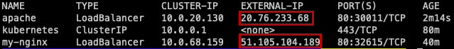
  
2. Go to the Azure portal and in Load Balancer Service check if Azure has now 3     unique IP addresses reserved.

    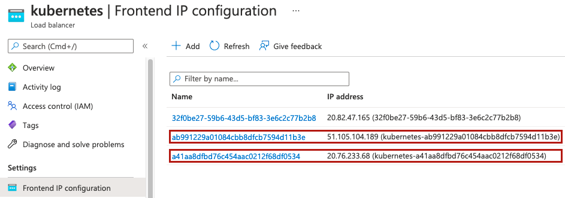


3. Please, delete deployments and services that your created:
    ```bash
    kubectl delete service my-nginx
    ```
    ```bash
    kubectl delete service apache
    ```

    and deployment
    
    ```bash
    kubectl delete deployment my-nginx
    ```
    ```bash
    kubectl delete deployment apache
    ```
      
## END LAB

<br><br>

<center><p>&copy; 2021 Chmurowisko Sp. z o.o.<p></center>
