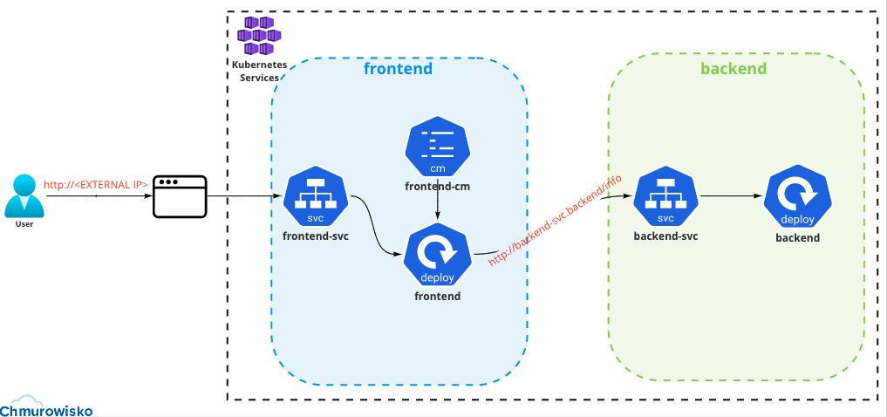

<br><br>
<br><br>
<br><br>

# Namespace
## LAB Overview
In this lab you will work with Namespace. 
Namespaces provides a mechanism for isolating groups of resources within a single cluster.

## Lab visualization:


## Task 1: Creating first namespace - **backend** and inside it creating deployment and service

1. Create a namespace named **backend** 
    
    ```bash
    kubectl create namespace backend
    ```
1. Inside **backend** namespace create deployment and service from file &#8594; backend.yaml
    
    ```bash
    kubectl create -f backend.yaml -n backend
    ```

   > **_NOTE:_** File `backend.yaml` use a public image from Docker Hub: <https://hub.docker.com/repository/docker/danchmpis/chm-k8s-namespace-backend>.\
   > This image was built using files from [./backend directory](./files/backend) 

2. Verify contents of the **backend** namespace:

    ```bash
    kubectl get all -n backend
    ```

## Task 2: Creating second namespace - **frontend** and inside it creating deployment, config map and service

1. Create a namespace named **frontend** 
   
    ```bash
    kubectl create namespace frontend
    ```

1. Create a config map, deployment and service from file &#8594; frontend.yaml (inside **frontend** namespace). This config map will be used by deployment.
   
   ```bash
    kubectl create -f frontend.yaml -n frontend
    ```

1. Verify contents of the **frontend** namespace:

    ```bash
    kubectl get all -n frontend
    ```

## Task 3: Accessing the service created in **frontend** namespace

1. Copy EXTERNAL-IP (public IP) from the service in frontend namespace:

    ```bash
    kubectl get service -n frontend
    ```
1. Send request to service **frontend-svc** using EXTERNAL-IP copied from the       previous step.

    ```bash
    curl <EXTERNAL-IP of frontend-svc>
    ```

    Verify the response to the request.

1. Also, you can open any browser and paste EXTERNAL-IP.

## Task 4: Delete everything you created in this task
1. By deleting two namespaces from this lab you will delete also everything inside them.

    Delete frontend namespace:
    ```bash
    kubectl delete namespace frontend
    ```

    Delete backend namespace:
    ```bash
    kubectl delete namespace backend
    ```
      
## END LAB

<br><br>

<center><p>&copy; 2022 Chmurowisko Sp. z o.o.<p></center>
