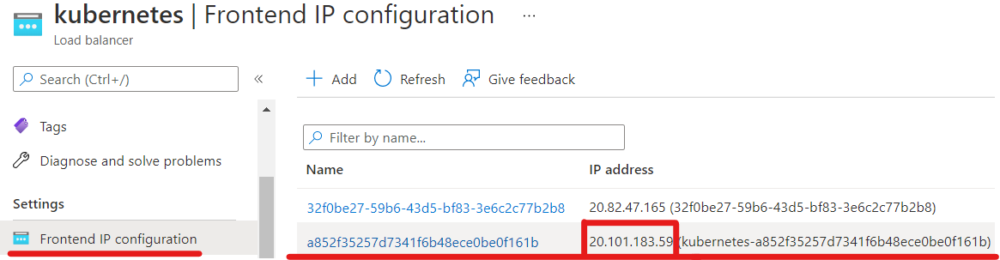

<br><br>
<br><br>
<br><br>

# Ingress

## Lab Overview

In this lab you will work create Ingress and expose a few services over single IP address.

During this lab you will install Nginx Ingress Controller.

## Task 1: Installing Nginx Ingress Controller

1. To install Nginx Ingress Controller type this command to the terminal (CloudShell):

    ```bash
    kubectl apply -f https://raw.githubusercontent.com/kubernetes/ingress-nginx/controller-v1.1.1/deploy/static/provider/cloud/deploy.yaml
    ```

1. Check if objects are created:

    ```bash
    kubectl get all -n ingress-nginx
    ```
    Find service named **ingress-nginx-controller** and copy **EXTERNAL-IP**.
    In the next Tasks you will create services that will be exposed over this Public IP.

    Go to the Azure portal and in Load Balancer Service check if Azure has now new unique IP addresse reserved - the same IP addresse you copied.
 

    

## Task 2. Create Services exposing sample applications

Applications use [`hashicorp/http-echo`](https://hub.docker.com/r/hashicorp/http-echo/) image. This image contains an in-memory web server that renders an HTML page containing the contents of the arguments provided to it. This image is especially useful for demos or a more extensive "hello world" Docker application.

In this example service named **frontend-svc** should return "frontend" plain text response. Service named **api-svc** should respond with "api".

1. Verify [file](./files/service1.yaml) of Service1
2. Create 2 services using command below: 

    ```bash
    kubectl apply -f service1.yaml -f service2.yaml
    ```

    Check if you have services named: **frontend-svc** and **api-svc**:
    ```bash
    kubectl get service
    ```

## Task 3: Create Ingress object

Ingress object will configure how incoming request should be routed.

1. Create Ingress object from [file](./files/ingress.yaml): 

    ```bash
    kubectl apply -f ingress.yaml
    ```

## Task 4: Try the solution

1. Using curl (or your browser) request following URLs:

    ```bash
    curl <EXTERNAL-IP>/
    curl <EXTERNAL-IP>/api
    ```

You should get different responses from both services you deployed in task 2.

## Task 5: Delete everything you created in this lab

1. Delete all you created by typing:
    ```bash
    kubectl delete -f .
    ```
1. Delete namespace **ingress-nginx**
    ```bash
    kubectl delete namespace ingress-nginx
    ```

## END LAB

<br><br>

<center><p>&copy; 2022 Chmurowisko Sp. z o.o.<p></center>
