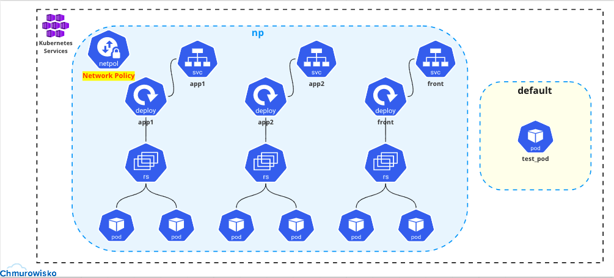
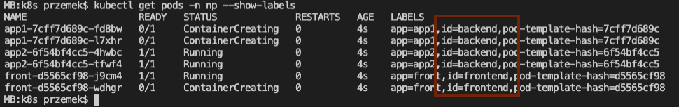

<br><br>
<br><br>
<br><br>

# Network Policies

## LAB Overview

In this lab you are going to create diffferent network policies and observe how to traffic is allowed/denied between pods.

## Lab visualization:


## Task 1: Deploying the application

1. Deploy the application

    ```bash
    kubectl apply -f 1_deployments.yaml
    ```

1. Find your *service* address by executing:

    ```bash
    kubectl get svc -n np
    ```

1. Check if the pods are running:

    ```bash
    kubectl get pods -n np --show-labels
    ```

Please notice, there are two groups of pods: backend and frontend.



## Task 2: Applying ingress network policies

1. Using second terminal window, run additional test pod by executing:

    ```bash
    kubectl run curl --image=radial/busyboxplus:curl -i --tty --rm
    ```

1. Inside the pod check if all the connections work by executing:

    - connection to frontend service: `curl -m 3 front.np`
    - connection to backend services: `curl -m 3 app1.np` and `curl -m 3 app2.np`
    - connection between frontend and backend pods: `curl -m 3 front.np/req?url=http://app1.np` and `curl -m 3 front.np/req?url=http://app2.np`

1. Exit the debug container: `exit`
1. Deny ingress traffic on backend pods by applying network policy:

    ```bash
    kubectl apply -f 2_ingress_policy.yaml
    ```

1. Create a test pod again and inside the test pod check connections:

    - to frontend service: `curl -m 3 front.np` (should be OK)
    - connection to backend services: `curl -m 3 app1.np` and `curl -m 3 app2.np`
    - connection between frontend and backend pods: `curl -m 3 front.np/req?url=http://app1.np`

1. Exit the container: `exit`
1. Allow ingress traffic to backend pods from frontend pods

    ```bash
    kubectl apply -f 3_allow_ingress_policy.yaml
    ```

1. Inside the test pod check connections:

    - to frontend service: `curl -m 3 front.np` (should be OK)
    - connection to backend services: `curl -m 3 app1.np` and `curl -m 3 app2.np`
    - connection between frontend and backend pods: `curl -m 3 front.np/req?url=http://app1.np` and `curl -m 3 front.np/req?url=http://app2.np` (should be OK)

## Task 3: Applying egress network policies

1. Deny outgoing traffic for frontend pods by applying egress policy:

    ```bash
    kubectl apply -f 4_egress_policy.yaml
    ```

1. Back, inside test pod check the connections:

    - between frontend and backend pods `curl -m 3 front.np/req?url=http://app1.np`

1. Allow egress traffic on frontend pods. Allow then to connect to backend pods:

    ```bash
    kubectl apply -f 5_allow_egress_policy.yaml
    ```

1. Back, inside test pod check the connections:

    - between frontend and backend pods `curl -m 3 front.np/req?url=http://app1.np`

1. Connection does not work, because DNS is not add as allowed service. In the next Task you will learn how to add DNS as an allowed service.
1. Check ip adresses for your backend pods

    ```
    kubectl get pods -n np -o wide
    ```

1. Copy the ip address of one of your backend pods and inside the test pod try connecting using that IP address:  

    ```bash
    curl -m 3 front.np/req?url=http://IP_ADDRESS:8080
    ```

Now the connection should be possible

## Task 4: Adding DNS as allowed service

1. Configure egress policy by executing:

    ```bash
    kubectl apply -f 6_dns_egress_policy.yaml
    ```

1. Inside test pod try connecting between frontend and backend pods: `curl -m 3 front.np/req?url=http://app1.np` Now the connection should be possible
1. Still in the test pod try connecting to Google from frontend pod: `curl -m 3 front.np/req?url=http://www.google.com`

## Task 5: Cleanup

1. Delete all resources by executing:

    ```bash
    kubectl delete ns np
    ```

## END LAB

<br><br>

<center><p>&copy; 2021 Chmurowisko Sp. z o.o.<p></center>
