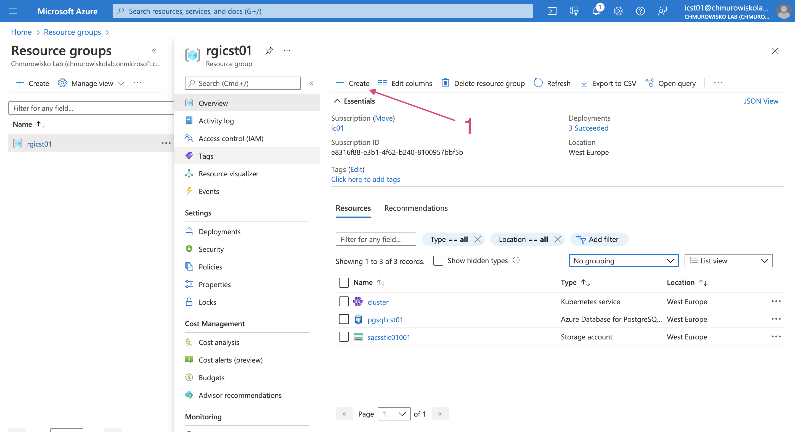
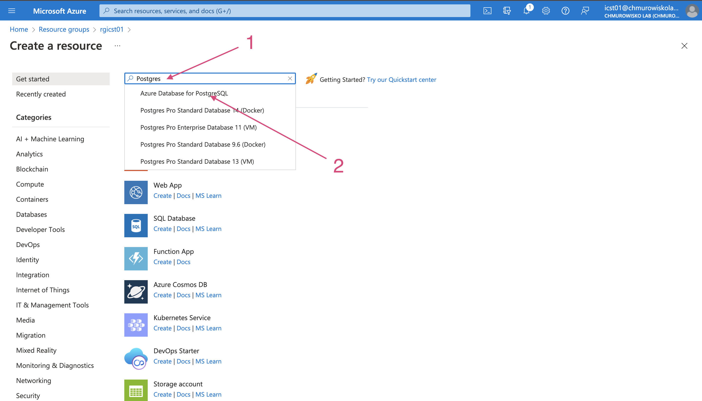
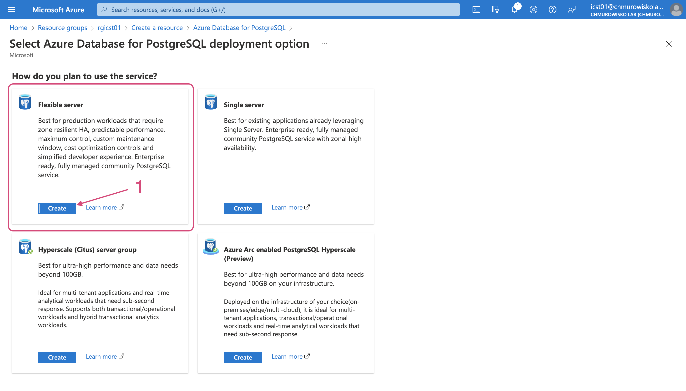
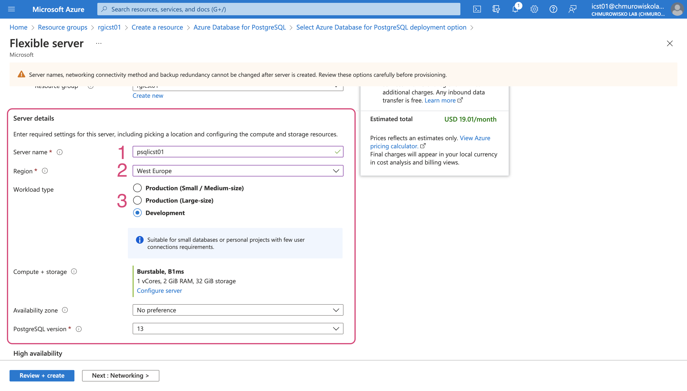
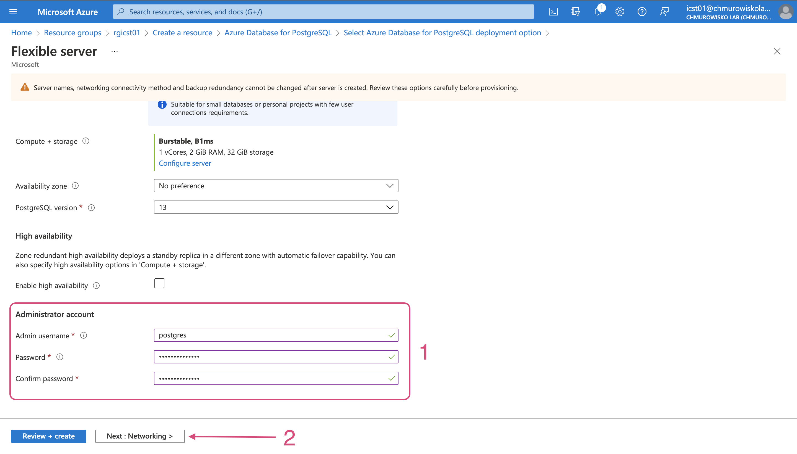
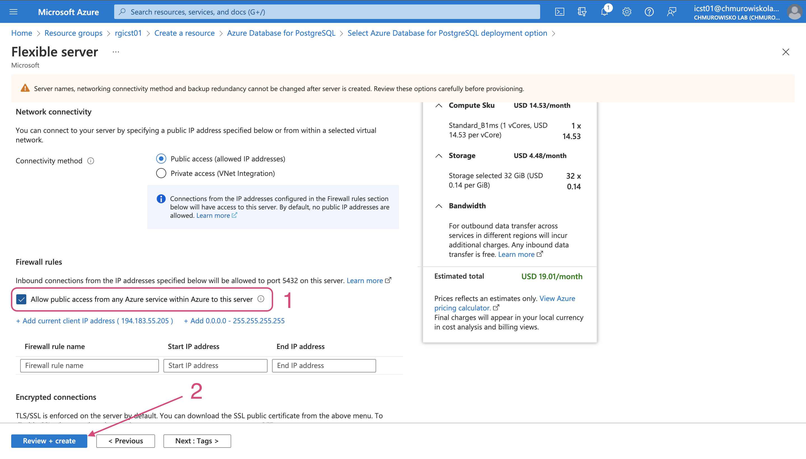
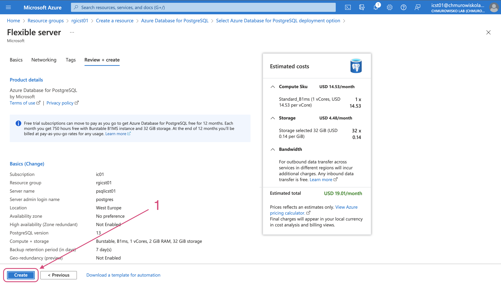
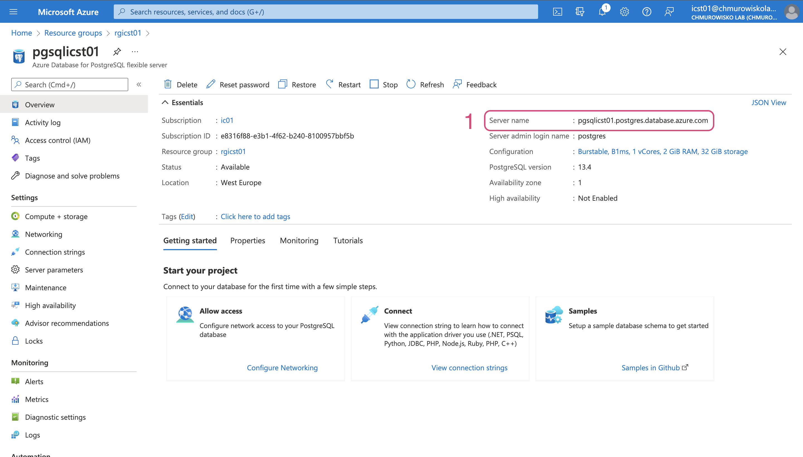

<br><br>
<br><br>
<br><br>

# Połączenie z bazą danych w usłudze Azure Database

---

## Krok 1: Utworzenie serwera Postgres w usłudze Azure Database

**Uwaga**: Przedstawiona poniżej konfiguracja dostępu do serwera Postgres jest zalecana jedynie na potrzeby szkoleniowe (lub w uzasadnionych przypadkach). W innych przypadkach rekomendujemy skonfigurowanie serwera w sposób umożliwiający połączenie z nim jedynie z usług znajdujących się w tej samej sieci wirtualnej. Aby skonfigurować infrastrukturę Azure w ten sposób wykorzystaj załączone [pliki Terraform](./terraform).

Wykonaj poniższe kroki:






W sekcji _Server details_ podaj poniższe wartości:

  - Server name: `psql<STUDENT_LOGIN>`
  - Region: `West Europe`
  - Workload type: `Development`



W sekcji _Administrator account_ podaj poniższe wartości:

  - Admin username: `postgres`
  - Password: `Chmurowisko123`



**Uwaga**: W tym kroku określisz sposób dostępu do serwera Postgres. Przedstawiona na rysunku konfiguracja pozwala na połączenie się z serwerem ze wszystkich usług w Azure. Jest to najprostsza opcja konfiguracji, ale nie najbezpieczeniejsza.




## Krok 2: Weryfikacja połączenia z AKS do Azure Database

1. Wyświetl stronę ze szczegółami serwera Postgres i skopiuj _Server name_:

    

1. Stwórz tymczasowy Pod do weryfikacji połączenia z serwerem Postgres:

    ```bash
    kubectl run debug --image=postgres -it --rm --restart=Never -- sh
    ```

1. Spróbuj połączyć się z serwerem Postgres:

    ```bash
    psql 'host=<DB_SERVER_NAME> port=5432 dbname=postgres user=postgres sslmode=require password=Chmurowisko123'
    ```

## Krok 3: Utwórz bazę danych i tabelę z danymi

1. Będąc połączonym z serwerem Postgres z testowego Pod wykonaj poniższe polecenia

    - Stwórz bazę danych `test`

        ```bash
        CREATE DATABASE test;
        ```

    - Połącz się z utworzoną bazą danych:

        ```
        \c test
        ```

    - Utwórz nową tabelę `people`

        ```
        CREATE TABLE people (
          pid SERIAL PRIMARY KEY,
          firstName varchar(255),
          lastName varchar(255)
        );
        ```

    - Dodaj dane do tabeli `people`:

        ```
        INSERT INTO people (firstName, lastName) VALUES ('Joe', 'Doe'), ('Jane', 'Dee');
        ```

    - Wykonaj testowe zapytanie o dane w tabeli `people`

        ```
        SELECT * FROM people;
        ```

## Krok 4: Wdróż aplikację odczytującą dane z bazy danych

**Uwaga**: kod wdrażanej w tym kroku aplikacji znajduje się w folderze [/app](./app). Obraz kontenera z aplikacją jest już udostępniony w [Docker Hub](https://hub.docker.com/repository/docker/macborowy/azure-database-psql).

1. Wyświetl zawartość pliku [/files/deployment.yaml](./files/deployment.yaml)
1. W ConfigMap `cm-azure-database-connection-details` zmień wartość dla klucza `PGHOST`. Upewnij się, że pozostałe wartości są zgodne z wartościami podanymi podczas konfiguracji serwera Postgres.
1. Wdróż aplikację na Kubernetes:

    ```bash
    kubectl apply -f deployment.yaml
    ```

1. Znajdź publiczny adres IP dla Service `api`:

    ```bash
    kubectl get svc
    ```

1. Wyślij request na endpoint `/people` i sprawdź czy otrzymujesz listę użytkowników zgodną z danymi w bazie danych:

    ```bash
    curl http://<API-PUBLIC-IP>/people
    ```

## END LAB

<br><br>

<center><p>&copy; 2022 Chmurowisko Sp. z o.o.<p></center>
