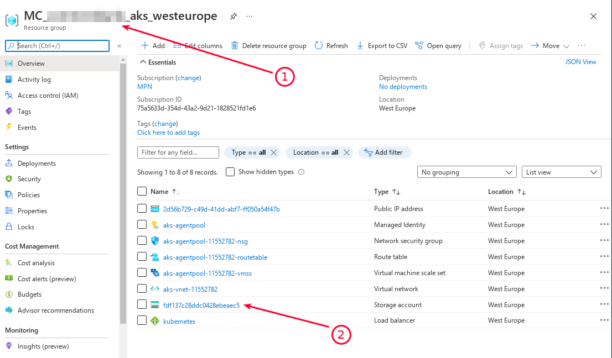
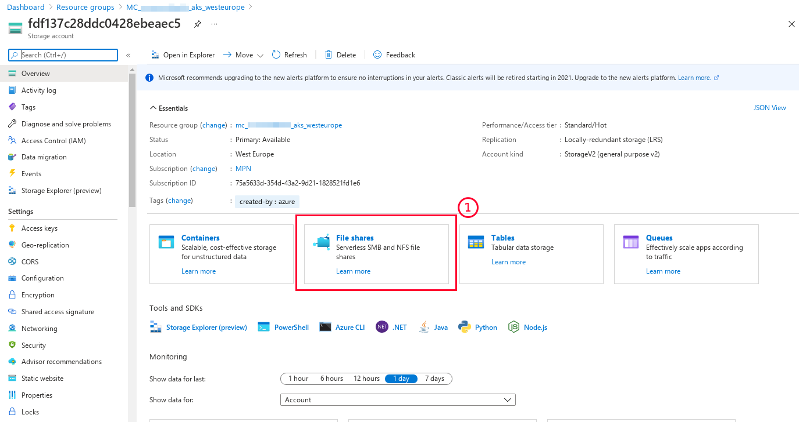
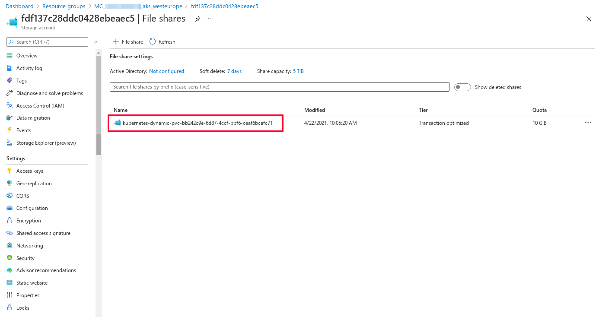
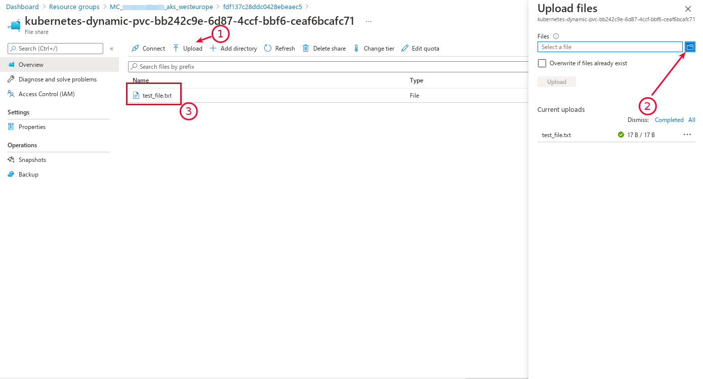
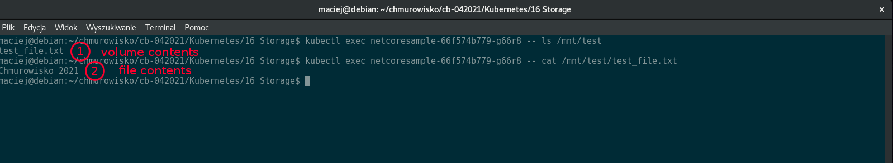

<br><br>
<br><br>
<br><br>

# Storage

---

## Tasks

1. A list of available StorageClass

   ```bash
   kubectl get sc
   ```

1. Print StorageClass details

   ```bash
   kubectl describe sc default
   ```

   ```bash
   kubectl describe sc managed-premium
   ```

1. Create PersistanceVolumeClaim with Azure Files storage class

   ```yaml
   apiVersion: v1
   kind: PersistentVolumeClaim
   metadata:
     name: azurefile
   spec:
     accessModes:
       - ReadWriteMany
     storageClassName: azurefile
     resources:
       requests:
         storage: 10Gi
   ```

1. Using the command below check if the PVC was created. Copy the name of PVC.

   ```bash
   kubectl get pvc
   ```

1. Create new Deployment with container using Azure Files PVC

   ```yaml
   apiVersion: apps/v1
   kind: Deployment
   metadata:
     name: netcoresample
     labels:
       app: sample
   spec:
     replicas: 2
     selector:
       matchLabels:
         app: sample
     template:
       metadata:
         labels:
           app: sample
       spec:
         containers:
           - name: netcoresample
             image: mcr.microsoft.com/dotnet/core/samples:aspnetapp
             ports:
               - containerPort: 80
             volumeMounts:
               - mountPath: "/mnt/test"
                 name: volume
         volumes:
           - name: volume
             persistentVolumeClaim:
               claimName: azurefile
   ```

1. Create a new file in Azure Files (using Portal).

   To create a file go to resource group named `MC_*` and open the Storage Account (the name is random and will vary from the one on the image):

   

   On the Storage Account page select "File Shares":

   

   There you should find single directory with a name matching the name of PVC you created.

   

   Then upload any file you want to be visible for the Pods. Here I'm uploading the file name `test_file.txt`.

   

1. Use `kubectl exec pod/<POD_NAME> -- ls /mnt/test` to get a content of the mounted volume.

   

## END LAB

<br><br>

<center><p>&copy; 2021 Chmurowisko Sp. z o.o.<p></center>
