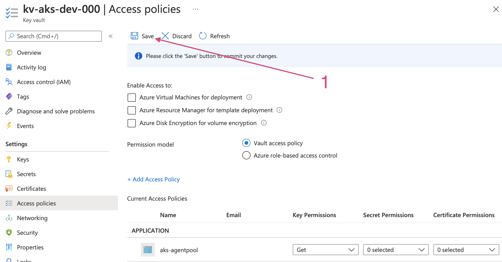

<br><br>
<br><br>
<br><br>

# AKS and Azure Key Vault

## LAB Overview

In this lab you are going to integrate your K8s cluster with Azure KeyVault. Azure Key Vault is a service used to store sensitive data, eg passwords, secrets and certificates.

This solution uses user-assigned managed identity that is attached to AKS cluster and has correct access rights to Azure Key Vault. 

What is more, the solution uses Azure CSI driver (https://github.com/Azure/secrets-store-csi-driver-provider-azure) for mounting key vault secrets as volumes. Container Storage Interface (CSI) is a standard for exposing arbitrary block and file storage systems to containerized workloads on Container Orchestration Systems (COs) like Kubernetes. (https://kubernetes-csi.github.io/docs/)

## Prerequisities:

- Helm 3 installed (if you don't have Helm installed locally you can use Azure Cloud Shell - it is already installed there)

## Task 1: Create Azure Key Vault

First we need to create Azure Key Vault service and store some sensitive information in it.

1. Login to Azure portal: `https://portal.azure.com`
1. Click **Create a resource** button
1. Search for **Key Vault** service, click **Create**
1. Fill the form:

    - **Resource group:** use your own resource group
    - **Key vault name:** choose your name
    - **Region:** West Europe
    - **Pricing Tier:** Standard

1. Go **Next** until last blade. Leave all fields by default.
1. Click **Create** and wait for the deployment to finish. Be sure to actually click "Create" after validation succeeded.

## Task 2: Create custom secrets in yout key vault

1. Open your Azure Key Vault service.
1. From the left pane select "Secrets".
1. Click "Generate/Import" button
1. Create secrets required to connect to Azure Database for Postgres (make sure values match your Postgres configuration):

    - Secret name: `PGUSER`, value: `postgres`
    - Secret name: `PGHOST`, value: `<DB_SERVER_NAME>`
    - Secret name: `PGPASSWORD`, value: `Chmurowisko123`
    - Secret name: `PGDATABASE`, value: `test`
    - Secret name: `PGPORT`, value: `5432`

    While creating a secret leave all other fields with default values

## Task 3: Assign proper access rights for Managed Identity to Key Vault

Now you create Access Policy for your cluster Managed Identity to get secrets from Key Vault.

1. Get AKS Managed Identity ID:

    ```bash
    az aks show -g <resource group> -n <aks cluster name> --query identityProfile.kubeletidentity.clientId -o tsv
    ```

    > Take note of this ID for later use.

1. Go to Azure Portal and select your Key Vault service.
1. Click **Access Policies** from left menu.
1. Click **Add access policy**
1. From **Secret permissions** section select checkbox next to **Get**
1. Click **Select principal** and in the search box enter your cluster's managed identity ID.
1. Select your identity and click on **Select** button. Apply settings by clicking on **Add** button.
1. Click on **Save** to persist your changes.

    

## Task 4: Delete ConfigMap with Azure Database credentials

The ConfigMap with Azure Database credentials will be no longer required, because credentials will be injected to Pod using Azure Key Vault provider.

1. Run following command:

    ```bash
    kubectl delete cm cm-azure-database-connection-details
    ```

## Task 5: Install Azure CSI driver

Now we are going install and Azure CSI driver.

1. Create namespace for CSI

    ```bash
    kubectl create ns csi
    ```

1. Add Helm repo:
   
    ```bash
    helm repo add csi-secrets-store-provider-azure https://raw.githubusercontent.com/Azure/secrets-store-csi-driver-provider-azure/master/charts
    ```

1. Install CSI driver:

    ```bash
    helm install csi csi-secrets-store-provider-azure/csi-secrets-store-provider-azure -n csi --set secrets-store-csi-driver.syncSecret.enabled=true
    ```

1. Verify the driver was installed successfully. Enter:

    ```bash
    kubectl get pods -n csi
    ```

## Task 6: Configure Secrets Provider

Now we need to configure the Azure CSI driver. 

1. Edit the [secret-provider](./files/secret-provider.yaml) file and set those values:

    - `userAssignedIdentityID`: `YOUR_MANAGED_IDENTITY_ID`
    - `keyvaultName`: `NAME_OF_YOUR_KEY_VAULT`
    - `objectName`: `NAME_OF_YOUR_SECRET`
    - `tenantId`: `YOUR_TENANT_ID` 

    `tenantId` can be read from Azure Portal (e.g.: from _Overview_ page of Azure Key Vault (field: `Directory ID`))

1. Apply the config: 

    ```bash
    kubectl apply -f secret-provider.yaml
    ```

## Task 7: Update `azure-database` deployment

1. Check the contents of the [./files/deployment.yaml](./files/deployment.yaml)

1. Apply new version of `azure-database` Deployment

    ```bash
    kubectl apply -f deployment.yaml
    ```

1. Verify that the Pod is Running:

    ```bash
    kubectl get pods
    ```

1. Verify the Environment Variables inside the Pod:

    ```bash
    kubectl exec <pod_name> -- env
    ```

1. Verify if application is still getting data from database

## END LAB

<br><br>

<center><p>&copy; 2021 Chmurowisko Sp. z o.o.<p></center>
