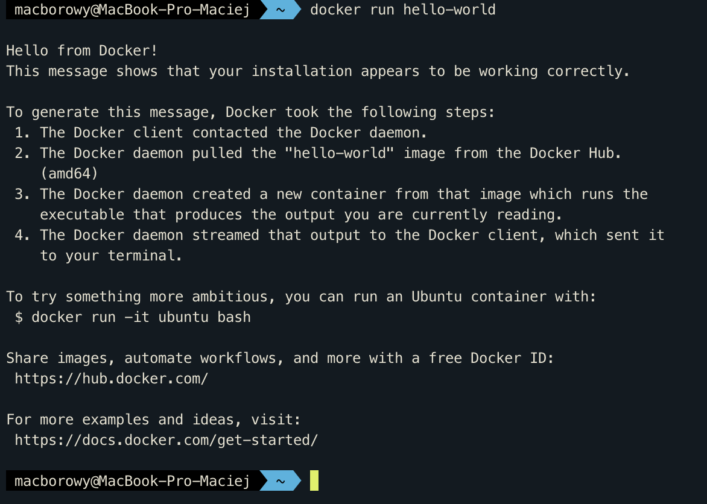
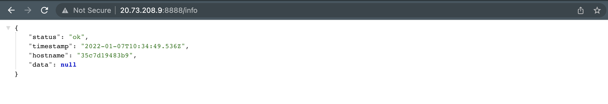
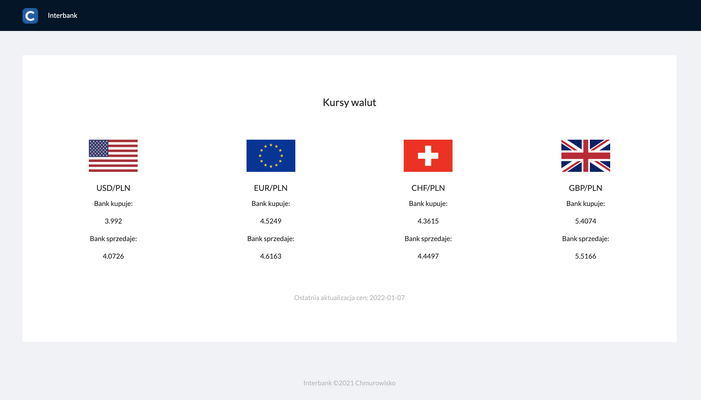

<br><br>
<br><br>
<br><br>

# Praca domowa 1

## Wstęp

Witaj w pierwszej pracy domowej w której uruchomisz aplikację składającą się z dwóch skonteneryzowanych usług (React oraz Node.js) na klastrze Kubernetes.

Na początek kilka informacji organizacyjnych:

1. Pierwszym krokiem pracy domowej jest zainstalowanie Docker. Zaprezentowaliśmy dwa scenariusze instalacji: na maszynie wirtualnej w Azure (tak jak na szkoleniu) lub na własnym sprzęcie. Ćwiczenia napisane są z punktu widzenia maszyny wirtualnej w Azure. Możesz wybrać opcję, która jest dla Ciebie wygodniejsza. 
1. Zadania z gwiazdką (`*`) są opcjonalne do wykonania. Zachęcamy do ich wykonania, ale nie są one niezbędne do ukończenia pracy domowej.

W razie jakichkolwiek pytań lub wątpliwości wyślij wiadomość na [maciej.borowy@chmurowisko.pl](mailto:maciej.borowy@chumrowisko.pl) lub [daniel.pisarek@chmurowisko.pl](mailto:daniel.pisarek@chumrowisko.pl).

---

## Utwórz maszynę laboratoryjną z Ubuntu w Azure (*)

⚠️ **Uwaga**: nie musisz wykonywać tego kroku jeśli instalujesz Docker na własnym sprzęcie.

### Po co? 

Domyślnie w [Azure Cloud Shell](https://docs.microsoft.com/en-us/azure/cloud-shell/overview) nie możemy korzystać ze wszystkich funkcji Docker. Rozwiązaniem tego problemu jest stworzenie dedykowanej maszyny wirtualnej z Ubuntu na której zainstalujemy Docker Engine i wykorzystamy pełen potencjał kontenerów.

### Kroki
 
1. Uruchom [Azure Cloud Shell](https://shell.azure.com)
1. Wywołaj poniższy snippet w Azure Cloud Shell. Zmień wartość zmiennej `RESOURCE_GROUP_NAME` na nazwę Resource Group do której masz dostęp i możesz tworzyć zasoby. W snippet użyjesz komendy [Azure CLI](https://docs.microsoft.com/en-us/cli/azure/install-azure-cli) `az vm create`, która stworzy maszynę wirtualną (2 CPU, 7 GiB RAM, Ubuntu). Do maszyny możesz zalogować się korzystając z loginu i hasła podanych w zmiennych `ADMIN_USERNAME` oraz `ADMIN_PASSWORD`.

    ```shell
    RESOURCE_GROUP_NAME="<resource_group_name>"
    VM_NAME="labvm"
    ADMIN_USERNAME="ubuntu"
    ADMIN_PASSWORD='Chmurowisko123!@#'

    az vm create -n $VM_NAME -g $RESOURCE_GROUP_NAME \
        --image "UbuntuLTS" \
        --authentication-type password \
        --admin-username $ADMIN_USERNAME \
        --admin-password $ADMIN_PASSWORD \
        --public-ip-sku Standard \
        --size Standard_DS2_v2
    ```

1. Po utworzeniu maszyny wirtualnej zmień ustawienia Network Security Group (NSG) i zezwól na ruch przychodzący na portach 80 oraz 8000-9000. Dzięki dodaniu tej reguły będziesz mógł wyświetlić aplikacje uruchomione za pomocą Docker w Twojej przeglądarce.

    ```shell
    NSG_NAME="${VM_NAME}NSG"

    az network nsg rule create \
        --name Custom_8000_9000 \
        --nsg-name $NSG_NAME \
        --resource-group $RESOURCE_GROUP_NAME \
        --destination-port-ranges 80 8000-9000 \
        --protocol Tcp \
        --priority 1100
    ```

1. Znajdź publiczny adres IP maszyny i połącz się z maszyną wirtualną za pomocą SSH.

    Publiczny adres IP maszyny znajdziesz w Azure Portal lub możesz skorzystać ze skryptu listującego maszyny wirtualne i ich adresy IP:
    
    ```shell
    az vm list-ip-addresses --query "[].{name:virtualMachine.name, publicIp: virtualMachine.network.publicIpAddresses[0].ipAddress}"
    ```

1. Połącz się z maszyną wirtualną za pomocą SSH. Pamiętaj, aby uzupełnić ją publicznym adresem IP Twojej VM.

    ```shell
    ssh ubuntu@<VM-PUBLIC-IP>
    ```

## Zainstaluj Docker na swojej maszynie lub maszynie laboratoryjnej (*)

### Po co?

Docker będzie niezbędny do wykonania kolejnych ćwiczeń w tej pracy domowej oraz może być przydatny do pracy z kontenerami podczas Twojej pracy w przyszłości. Warto zainstalować go już teraz.

### Kroki

1. Wyświetl stronę [Install Docker Engine](https://docs.docker.com/engine/install/) i wybierz instrukcję instalacji odpowiednią dla swojego systemu operacyjnego. Wykonaj wszystkie kroki wymienione w instrukcji i sprawdź czy możesz uruchomić kontener z obrazem [hello-world](https://hub.docker.com/_/hello-world). Rezultat jaki otrzymasz po uruchomieniu kontenera powinien być podobny do poniższego:
    
    

### Dodatkowe informacje

1. Brak uprawnień do wywołania komend Docker CLI

    W przypadku uruchamiania komend Docker CLI możesz spotkać się z problemem braku uprawnień:

    ```shell
    docker: Got permission denied while trying to connect to the Docker daemon socket at unix:///var/run/docker.sock: Post "http://%2Fvar%2Frun%2Fdocker.sock/v1.24/containers/create": dial unix /var/run/docker.sock: connect: permission denied.
    ```

    W tym przypadku powinieneś dodać swojego użytkownika (`ubuntu`) do grupy użytkowników `docker`. Skopiuj poniższą komendę i nie zmieniając jej treści wykonaj na maszynie wirtualnej z Linux. Następnie przeloguj swojego użytkownika (zakończ i rozpocznij na nowo sesję SSH).
    
    ```shell
    sudo usermod -aG docker $USER
    ```

1. Licencje Docker Desktop

    Jeśli instalujesz Docker na systemie operacyjnym z rodziny Linux wystarczy jeśli zainstalujesz Docker Engine. Docker Engine udostępniany jest na licencji Apache License 2.0 ([link](https://docs.docker.com/engine/#licensing)). Instalując Docker na systemie operacyjnym z rodziny Linux nie musisz instalować Docker Desktop.

    Jeśli instalujesz Docker na sprzęcie z Windows lub MacOS musisz zainstalować Docker Desktop. Docker Desktop podlega płatnej licencji w szczególnych przypadkach ([link](https://docs.docker.com/subscription/#docker-desktop-license-agreement)). Docker Desktop pozostaje darmowy gdy używamy go: na własny użytek, w celach edukacyjnych, w organizacjach non-profit lub komercyjnie w organizacjach zatrudniających mniej niż 250 pracowników i mających poniżej 10 000 000$ przychodu w skali roku.

## Zapoznaj się ze stronami pomocy Docker w terminalu

### Po co?

Wiedza w jaki sposób znaleźć strony pomocy dla interesujących nas komendy oraz jak takie strony wyglądają może ułatwić i przyspieszyć pracę w przyszłości. Naszym zdaniem strony pomocy w Docker CLI są czytelniejsze niż ich odpowiedniki w sieci Internet :)

### Kroki

1. Wyświetl stronę pomocy dla komendy `docker build`
1. Wyświetl stronę pomocy dla komendy `docker run`
1. Sprawdź w jaki sposób możesz podać zmienne środowiskowe uruchamiając kontener

### Podpowiedzi

1. Aby wyświetlić stronę pomocy użyj flagi `--help`
1. Zmienne środowiskowe dla kontenera możesz podać podczas uruchamiania go za pomocą komendy `docker run`. Mimo to, nie jest to jedyny sposób podania zmiennych środowiskowych do kontenera.

## Zbuduj i uruchom kontenery

### Po co?

Budowanie obrazów kontenera i uruchamianie ich jest chlebem powszednim pracy z kontenerami. Bez tego ani rusz 😁 

### Kroki

1. Pobierz kod z tego repozytorium na dysk za pomocą `git clone`
1. Zbuduj każdą za aplikacji jako osobny obraz kontenera. Kod aplikacji React znajduje się w katalogu `/app/packages/frontend/`. Kod aplikacji API znajduje się w katalogu `/app/packages/api`. Nazwij obrazy kontenerów odpowiednio: 

    - dla aplikacji frontend - `app-frontend`
    - dla aplikacji API - `app-api`

1. Uruchom oba kontenery i sprawdź w przeglądarce czy otrzymujesz odpowiedzi jak poniżej:

    - Aplikacja: frontend, protokół: http, port: 80, path: `/`

        

        Powyższy rezultat jest spodziewany, ponieważ aplikacja Frontend nie jest jest skonfigurowana z poprawnym adresem API z którego może pobrać dane. W tym momencie aplikacja odwołuje się pod domyślny adres `http://localhost:8001` zdefiniowany w kodzie aplikacji. Adres ten nie powinien w tym momencie w ogóle istnieć. Port w domyślnym adresie jest celowo niezgodny z portem na którym działa aplikacja API - `8888`. W kolejnych krokach tej pracy domowej ustawisz poprawny adres API za pomocą zmiennych środowiskowych.

    - Aplikacja: api, protokół: http, port: 8888, path: `/info`
        
        

### Podpowiedzi

1. Użyj komendy `docker build` do zbudownia kontenera oraz komendy `docker run` do uruchomienia kontenera.
1. Chcąc aby kontenery nie zajmowały Twojej sesji terminala możesz uruchomić je w tle za pomocą `docker run -d`.
1. Pamiętaj o odpowiedniej konfiguracji przekierowania portów za pomocą `docker run -p`. W przeciwnym razie nie otrzymasz odpowiedzi z aplikacji uruchomionej w kontenerze. Frontend działa na porcie 80, a API na porcie 8888.

## Zbuduj i uruchom kontenery w trybie "developerskim" (*)

### Po co?

Podczas codziennej pracy z kontenerami przydaje się możliwość obserwowania efektów pracy bez konieczności przebudowywania kontenera po każdej edycji kodu. Jest to szczególnie przydatne gdy nasz kontener buduje się długo. Tworząc odpowiedni Dockerfile, montując kod aplikacji z dysku hosta jako [volumen](https://docs.docker.com/storage/volumes/) oraz uruchamiając aplikację w kontenerze za pomocą dodatkowych programów (np. [nodemon](https://www.npmjs.com/package/nodemon) lub [CRA](https://create-react-app.dev/) development server) możemy osiągnąć efekt prawie natychmiastowego odświeżania kodu aplikacji po każdej zmianie.

### Kroki

1. Uruchom kontener w trybie developerskim
1. Upewnij się, że aplikacje zwracają spodziewane rezultaty
1. Zweryfikuj, że możesz zmienić kod bez konieczności przebudowywania kontenera

### Podpowiedzi

1. Aby uruchomić kontener w trybie deweloperskim powinieneś zbudować kontener z innym plikem Dockerfile. U nas jest to `Dockerfile_dev`. Dodatkowo, powinieneś zamontować folder z kodem z Twojego lokalnego dysku jako volumen na kontenerze.
1. ⚠️ **Uwaga**: jeśli na Twojej maszynie nie uruchomiłeś `npm install` to podczas podmontowywania lokalnego folderu z kodem musisz skonfigurować dodatkowy __anonymous volume__. Taki volumen spowoduje, że Docker podczas podmontowywania folderu z kodem pozostawił folder `/home/app/node_modules`, który stworzył podczas tworzenia kontenera. Aby stworzyć __anonymous volume__ zdefiniuj dodatkowy volumen uruchamiając `docker run`: `docker run -v /home/app/node_modules`. Jeśli nie zdefiniujesz __anonymous volume__ Docker nadpisze zawartość katalogu `/home/app` zawartością z lokalnego katalogu, który nie posiada `node_modules`. W efekcie program zwróci błąd z informacją o braku wymaganych zależności.

## Skomunikuj kontenery ze sobą

### Po co?

Aplikacja przygotowana w tej pracy domowej składa się z dwóch części - aplikacji Frontend oraz aplikacji API. Aplikacje są niezależnymi usługami sieciowymi. Architektura systemu została zaprojektowana tak, żeby aplikacja Frontend odpytywała o dane aplikację API. Odpytywanie aplikacji realizowane jest za pomocą protokołu HTTP.

W tym ćwiczeniu spróbujesz skomunikować kontenery ze sobą aby aplikacja Frontend mogła zaprezentować użytkownikowi dane o kursach walut.

### Kroki

1. Uruchom kontener z obrazem `app-frontend:latest` podając zmienną środowiskową `API_URL` z poprawnym adresem URL do aplikacji API
1. Uruchom kontener z obrazem `app-api:latest`
1. Sprawdź czy aplikacja Frontend prezentuje dane o kursach:

    

### Podpowiedzi

1. W jednym z zadań tej pracy domowej dowiedziałeś się jak uruchomić kontener podając do niego zmienną środowiskową. Wykorzystaj poznany mechanizm w tym zadaniu.

### Dodatkowe informacje

1. W aplikacji React wykorzystujemy mechanizm odczytywania zmiennych środowiskowych opisany w artykule: https://www.freecodecamp.org/news/how-to-implement-runtime-environment-variables-with-create-react-app-docker-and-nginx-7f9d42a91d70/

## Uruchom kontenery za pomocą Docker Compose (*)

### Kroki

1. Zainstaluj Docker Compose na swoim systemie operacyjnym: https://docs.docker.com/compose/install/
1. Sprawdź wartość zmiennej środowiskowej `API_URL` w `docker-compose.yaml`. Upewnij się, że wartość zmiennej wskazuje na adres URL aplikacji 
1. Uruchom kontenery za pomocą Docker Compose

### Podpowiedzi

1. Uruchom kontenery za pomocą komendy `docker-compose up`
1. W repozytorium znajduje się plik `docker-compose.dev.yaml`. Pozwala on uruchomić kontenery w trybie developerskim. Możesz uruchomić kontenery w trybie developerskim używając komendy: `docker-compose -f docker-compose.dev.yaml up --build`. `--build` buduje obrazy kontenera przed uruchomieniem. Opcja przydaje się, gdy zmieniamy plik `docker-compose.yaml` na `docker-compose.dev.yaml` (i vice versa). Dzięki użyciu `--build`  możemy być pewni, że uruchamiamy kontenery zbudowane z poprawnych Dockerfile.

## Udostępnij kontenery w Docker Hub

### Po co?

Chcąc uruchomić skonteneryzowaną aplikację na klastrze musimy udostępnić obraz kontenera z aplikacją w repozytorium obrazów. W tym ćwiczeniu skorzystamy z Docker Hub, ponieważ jest to na razie jedyne repozytorium obrazów kontenerów jakie poznaliśmy na przestrzeni szkolenia.

### Kroki

1. Utwórz konto użytkownika w Docker Hub: https://hub.docker.com/signup. W razie problemów zobacz video z [instrukcją zakładania konta](https://www.youtube.com/watch?v=ty91qhd7L24)
1. Zaloguj się do Docker Hub za pomocą komendy `docker login` wywołanej w terminalu
1. Udostępnij obrazy w dedykowanych repozytoriach utworzonych w ramach Twojego konta na Docker Hub

    Aby udostępnić obrazy w Docker Hub musisz otagować je w taki sposób, aby zawierały Twoją nazwę użytkownika. W ten sposób Docker wie do że obrazy powinien udostępnić w repozytorium stworzonym na Twoim koncie.
    
    ```shell
    docker tag app-frontend <dockerID>/chmurobank-frontend
    docker tag app-api <dockerID>/chmurobank-api
    ```

1. Udostępnij obrazy w Docker Hub za pomocą komendy `docker push`

## Utwórz klaster AKS

### Po co?

Klaster Kubernetes jest niezbędny do wykonania kolejnych ćwiczeń 😁  

### Kroki

1. Uruchom Azure Cloud Shell
1. Utwórz klaster AKS korzystając z poniższej komendy (może zająć 5-10 minut). Uzupełnij `<RESOURCE-GROUP-NAME>` nazwą swojej Resource Group.

    ```shell
    az aks create -n cluster -g <RESOURCE-GROUP-NAME> --node-count 1
    ```

1. Skonfiguruj połączenie pomiędy terminalem, a klastrem

    ```shell
    az aks get-credentials -n cluster -g <RESOURCE-GROUP-NAME>
    ```

1. Sprawdź czy Node (maszyny wirtualnej) są w statusie `Ready`

### Dodatkowe informacje

Jeśli chcesz używać `az` z poziomu swojego terminala musisz go doinstalować. Instrukcje instalacji dla swojego systemu operacyjnego znajdziesz w dokumentacji: https://docs.microsoft.com/en-us/cli/azure/install-azure-cli

## Uruchom aplikacje frontend i API na klastrze

### Po co?

W tym ćwiczeniu uruchomisz aplikację Frontend oraz API na klastrze i wykorzystasz potencjał zarządzania kontenerami jaki daje Ci Kubernetes.

### Kroki

1. Skorzystaj z poniższego template do stworzenia własnych Deployments

```yaml
apiVersion: apps/v1
kind: Deployment
metadata:
  labels:
    <deployment-label-key>: <deployment-label-value>
  name: <deployment-name>
spec:
  replicas: <number-of-replicas>
  selector:
    matchLabels:
      <pod-label-key>: <pod-label-value>
  template:
    metadata:
      labels:
        <pod-label-key>: <pod-label-value>
    spec:
      containers:
      - image: <repository-name-from-dockerhub>
        name: <container-name>
        ports:
        - containerPort: <application-port>
```

### Podpowiedzi

1. Skorzystaj z obiektów Deployment
1. Pamiętaj, że referując do obrazu kontenera w Docker Hub powinieneś użyć formatu `<username>/<image-name>[:<tag>]`)
1. W razie problemów z uruchomieniem aplikacji sprawdź informacje prezentowane przez `docker describe pod <pod-name>` oraz `docker logs <pod-name>`

## Utwórz kontener debug, którym sprawdzisz komunikację z Pod

### Po co?

W tym ćwiczeniu stworzymy tymczasowy Pod o nazwie debug. Będzie on używany tylko w celach developersko-diagnostycznych, żeby odpytać aplikację znajdujące się na klastrze bez publikowania ich do sieci Internet. Jest to częsty sposób na weryfikację działania aplikacji w Pod. 

### Kroki

1. Sprawdź adresy IP Pod z aplikacją frontend i API
1. Uruchom tymczasowy Pod z nazwą `debug` wykorzystujący kontener z obrazem `node`. Pod będzie używany w celach sprawdzenia odpowiedzi z Pod z aplikacjami.
1. Mając uruchomioną sesję bash w kontenerze z `node` sprawdź odpowiedzi z aplikacji za pomocą `curl`

    ```shell
    curl http://10.0.0.1
    curl http://10.0.0.1:8888/info
    ```

    ```shell
    # Expected output from frontend
    # curl http://10.0.0.1
    # <!doctype html><html lang="en"><head><meta charset="utf-8"/><link rel="icon" href="/favicon.png"/><meta name="viewport" content="width=device-width,initial-scale=1"/><meta name="theme-color" content="#000000"/><title>Chmurobank - szkolenie Chmurowisko 2021</title><link rel="preconnect" href="https://fonts.googleapis.com"><link rel="preconnect" href="https://fonts.gstatic.com" crossorigin><link href="https://fonts.googleapis.com/css2?family=Lato:ital,wght@0,400;0,700;1,300&display=swap" rel="stylesheet"><script src="/env-config.js"></script><link href="/static/css/2.a95be28f.chunk.css" rel="stylesheet"><link href="/static/css/main.ec668560.chunk.css" rel="stylesheet"></head><body><noscript>You need to enable JavaScript to run this app.</noscript><div id="root"></div><script>!function(e){function r(r){for(var n,f,l=r[0],i=r[1],a=r[2],c=0,s=[];c<l.length;c++)f=l[c],Object.prototype.hasOwnProperty.call(o,f)&&o[f]&&s.push(o[f][0]),o[f]=0;for(n in i)Object.prototype.hasOwnProperty.call(i,n)&&(e[n]=i[n]);for(p&&p(r);s.length;)s.shift()();return u.push.apply(u,a||[]),t()}function t(){for(var e,r=0;r<u.length;r++){for(var t=u[r],n=!0,l=1;l<t.length;l++){var i=t[l];0!==o[i]&&(n=!1)}n&&(u.splice(r--,1),e=f(f.s=t[0]))}return e}var n={},o={1:0},u=[];function f(r){if(n[r])return n[r].exports;var t=n[r]={i:r,l:!1,exports:{}};return e[r].call(t.exports,t,t.exports,f),t.l=!0,t.exports}f.m=e,f.c=n,f.d=function(e,r,t){f.o(e,r)||Object.defineProperty(e,r,{enumerable:!0,get:t})},f.r=function(e){"undefined"!=typeof Symbol&&Symbol.toStringTag&&Object.defineProperty(e,Symbol.toStringTag,{value:"Module"}),Object.defineProperty(e,"__esModule",{value:!0})},f.t=function(e,r){if(1&r&&(e=f(e)),8&r)return e;if(4&r&&"object"==typeof e&&e&&e.__esModule)return e;var t=Object.create(null);if(f.r(t),Object.defineProperty(t,"default",{enumerable:!0,value:e}),2&r&&"string"!=typeof e)for(var n in e)f.d(t,n,function(r){return e[r]}.bind(null,n));return t},f.n=function(e){var r=e&&e.__esModule?function(){return e.default}:function(){return e};return f.d(r,"a",r),r},f.o=function(e,r){return Object.prototype.hasOwnProperty.call(e,r)},f.p="/";var l=this.webpackJsonpfrontend=this.webpackJsonpfrontend||[],i=l.push.bind(l);l.push=r,l=l.slice();for(var a=0;a<l.length;a++)r(l[a]);var p=i;t()}([])</script><script src="/static/js/2.69378b64.chunk.js"></script><script src="/static/js/main.affd0915.chunk.js"></script></body></html>

    # Expected output from API
    # curl http://10.0.0.1:8888/info
    # {"status":"ok","timestamp":"2022-01-08T09:54:29.508Z","hostname":"api-5dd59b49b8-d8tx2","data":null}
    ```

### Podpowiedzi

1. Sesję bash możesz zakończyć komendą `exit`.

## Utwórz Service aby komunikować się z Pod posługując się znaną nazwą DNS

### Po co?

Każdy Pod na klastrze posiada swój unikalny adres IP. Komunikacja z Pod za pomocą adresów IP jest możliwa, ale nie jest wygodna (adresami IP trzeba zarządzać). W tym ćwiczeniu stworzysz obiekt typu Service, który przejmie odpowiedzialność za zarządzanie adresami IP i udostępni dla Ciebie jedną znaną nazwę DNS pod którą dostępne będą Twoje Pod. Korzystając z Service będziesz w stanie wykonywać requesty pod adres np. http://api nie znając konkretnych adresów IP dla każdego Pod oraz będziesz w stanie wykorzystać mechanizm Load Balancingu, który realizują Service.

### Kroki

1. Skorzystaj z poniższego template do stworzenia własnych Service

    ```yaml
    apiVersion: v1
    kind: Service
    metadata:
    labels:
      <service-label-key>: <service-label-value>
    name: <service-name>
    spec:
    type: ClusterIP
    ports:
    - port: <service-port>
      protocol: TCP
      targetPort: <application-port>
    selector:
      <pod-label-key>: <pod-label-value>
    ```

1. Sprawdź przyznane do Service adresy IP wewnątrz klastra
1. Utwórz kontener debug, którym sprawdzisz komunikację z Pod. Wyślij request za pomocą `curl` pod adres IP Service oraz pod jego nazwę DNS.
1. Upewnij się, że requesty wysyłane do Service dla aplikacji API obsługiwane są przez różne Pod należące do tego samego Deployment. Najłatwiejszym sposobem jest wysłanie kilku requestów na endpoint `/info` i porównanie wartości `hostname` w otrzymanej odpowiedzi.

    ```shell
    $ while true; do curl http://10.0.248.152:8888/info && echo && sleep 1; done

    {"status":"ok","timestamp":"2022-01-08T10:13:38.862Z","hostname":"api-66fd55f5c-gd6ns","data":null}
    {"status":"ok","timestamp":"2022-01-08T10:13:39.876Z","hostname":"api-66fd55f5c-gd6ns","data":null}
    {"status":"ok","timestamp":"2022-01-08T10:13:40.889Z","hostname":"api-66fd55f5c-z5ck5","data":null}
    {"status":"ok","timestamp":"2022-01-08T10:13:41.903Z","hostname":"api-66fd55f5c-z5ck5","data":null}
    {"status":"ok","timestamp":"2022-01-08T10:13:42.919Z","hostname":"api-66fd55f5c-bkrrm","data":null}
    {"status":"ok","timestamp":"2022-01-08T10:13:43.946Z","hostname":"api-66fd55f5c-gd6ns","data":null}
    {"status":"ok","timestamp":"2022-01-08T10:13:44.958Z","hostname":"api-66fd55f5c-gd6ns","data":null}
    {"status":"ok","timestamp":"2022-01-08T10:13:45.972Z","hostname":"api-66fd55f5c-gd6ns","data":null}
    {"status":"ok","timestamp":"2022-01-08T10:13:46.986Z","hostname":"api-66fd55f5c-z5ck5","data":null}
    ```

## Udostępnij aplikacje poza klaster

### Po co?

Chcąc, żeby aplikacja była dostępna poza klastrem dla użytkowników końcowych musisz odpowiednio skonfigurować Service

### Kroki

1. Zmień typ Service z `ClusterIP` na `LoadBalancer`
1. Sprawdź, że aplikacje dostępne są poza klastrem. Pamiętaj o użyciu odpowiednich portów podanych podczas konfiguracji Service.
1. Zaktualizuj zmienną środowiskową dla Podów z aplikacją Frontend aby wykonywała requesty pod publiczny adres IP Service dla aplikacji API 
1. Sprawdź czy Frontend wyświetla odpowiedzi z API

    

### Podpowiedzi

1. Za równo Frontend jak i API powinny być udostępnione publicznie. Zadaniem aplikacji Frontend jest zwrócenie użytkownikowi plików `*.html`, `*.css` oraz `*.js`. Pliki `*.js` zawierają aplikacje React uruchamianą w przeglądarce użytkownika. Dane prezentowane w aplikacji React pobierane są z API. Oznacza to, że API musi być dostępne publicznie w sieci Internet (tak samo jak Frontend).
1. Aby udostępnić aplikacje publicznie skorzystaj z Service typu `LoadBalancer`. Service będą miały różne publiczne adresy IP.
1. Zmienne środowiskowe dla Pod możesz ustawić korzystając z opisanego tu podejścia: https://kubernetes.io/docs/tasks/inject-data-application/define-environment-variable-container/#define-an-environment-variable-for-a-container
1. Service udostępnione są do sieci Internet przez HTTP. Upewni się, że wykonując requesty nie wykonujesz ich korzystając z HTTPS.
1. Gdybyś po ustawieniu zmiennych środowiskowych nie widział poprawnych odpowiedzi z API w aplikacji frontend. Wywołaj stronę w prywatnym oknie przeglądarki lub w spróbuj usunąć wszystkie Pod za pomocą `kubectl delete pod --all` (w efekcie Kubernetes powinien stworzyć nowe Pody).

---

<br><br>

<center><p>&copy; 2022 Chmurowisko Sp. z o.o.<p></center>